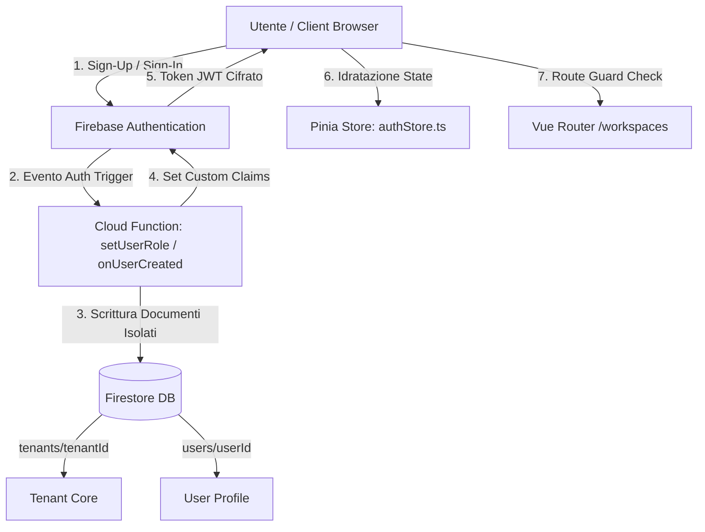
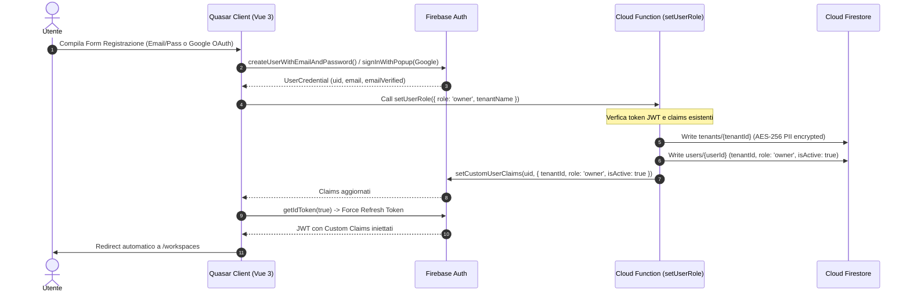
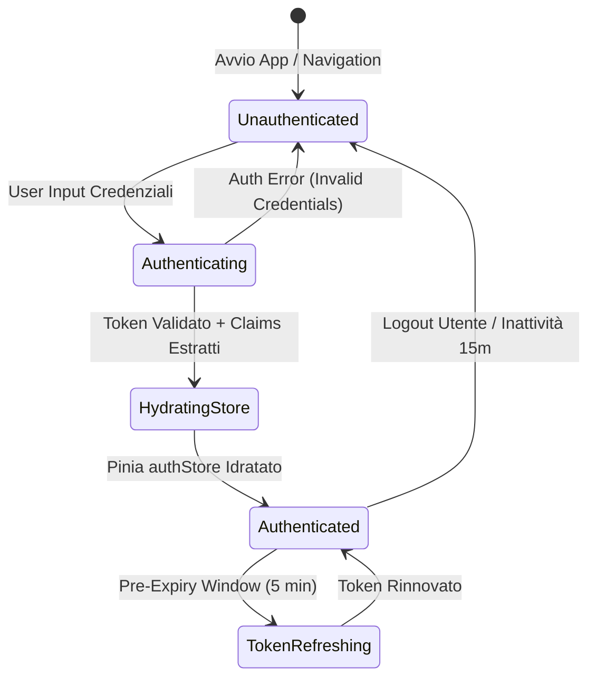

# 🏛️ OpsFlow — Architectural Flow 01: Auth, Registration & Multi-Tenancy

> **Componente:** Authentication, User Provisioning & Tenant Isolation  
> **Tecnologie:** Firebase Auth, Firestore, Pinia (`authStore.ts`), Cloud Functions Gen 2 (`setUserRole`)  
> **Standard:** GDPR Art. 32, Anti-XSS, JWT-Only Role Authorization (§3, §5 AGENTS.md)  
> **Stato Documento:** Definitivo — Principal Architecture Approved

---

## 📌 1. Panoramica del Flusso

L'architettura di autenticazione e multi-tenancy di **OpsFlow** implementa un modello **Tenant-Isolated Enterprise SaaS**. Ogni utente appartiene a un tenant primario isolato (`tenants/{tenantId}`). Le autorizzazioni di navigazione e accesso ai dati vengono verificate esclusivamente tramite i **Custom Claims del Token JWT** (`tenantId`, `role`), senza effettuare interrogazioni `getDoc` a Firestore per autorizzare la navigazione (principio di **Zero-Query RBAC**, §5 AGENTS.md).



---

## 🔐 2. Flusso Dettagliato di Registrazione (Sign-Up) & Tenant Provisioning

### Sequence Diagram: Sign-Up & Claim Injection



### Struttura Dati Firestore

#### Documento Tenant: `tenants/{tenantId}`

```json
{
  "tenantId": "t_abc123xyz",
  "name": "Acme Corp Ltd",
  "ownerId": "usr_998877",
  "createdAt": "2026-09-02T18:00:00.000Z",
  "status": "active",
  "subscription": {
    "plan": "enterprise",
    "maxWorkspaces": 10,
    "maxUsers": 50
  }
}
```

#### Documento Utente: `users/{userId}`

```json
{
  "uid": "usr_998877",
  "tenantId": "t_abc123xyz",
  "email": "admin@acme.com",
  "displayName": "Mario Rossi",
  "role": "owner",
  "isActive": true,
  "createdAt": "2026-09-02T18:00:00.000Z",
  "lastLoginAt": "2026-09-02T18:05:00.000Z"
}
```

---

## 🔑 3. Flusso di Login, Idratazione Sessione & Route Guards

### State Diagram: Ciclo di Vita della Sessione Utente



### Logica di Navigation Guard (`Vue Router`)

```typescript
// Router Guard Logic (Pseudo-code)
router.beforeEach(async (to, from, next) => {
  const authStore = useAuthStore();
  const isAuthenticated = authStore.isAuthenticated;
  const userRole = authStore.userRole; // Estratto dal JWT Claim (No Query Firestore)

  if (to.meta.requiresAuth && !isAuthenticated) {
    return next({ path: "/login", query: { redirect: to.fullPath } });
  }

  if (to.path === "/login" && isAuthenticated) {
    return next({ path: "/workspaces" });
  }

  if (to.meta.requiredRole && userRole !== to.meta.requiredRole) {
    return next({ path: "/unauthorized" });
  }

  next();
});
```

---

## 🧹 4. Gestione Inattività, Refresh Token e Logout Sicuro (§5 AGENTS.md)

1. **Auto-Logout per Inattività (GDPR Art. 32):**
   - Timer client-side impostato su 15 minuti su dispositivi o tab inattive.
   - Trigger automatico della procedura `authStore.logout()`.
2. **Procedura di Logout Sicuro (No LocalStorage Erasure):**
   - **Divieto Assoluto (§5 AGENTS.md):** MAI chiamare `localStorage.clear()` per non distruggere la cache offline locale dell'utente (`opsflow_user_{userId}_{dbName}`).
   - **Azione Eseguita:**
     1. Reset stato Pinia (`authStore.$reset()`, `workspaceStore.$reset()`).
     2. Invocazione `signOut(firebaseAuth)`.
     3. Rimuovere unicamente i session token effimeri.
     4. Redirect pulito a `/#/login`.

---

## 🛠️ 5. Tabella Sintetica dei Custom Claims JWT

| Claim Key  | Tipo                             | Descrizione                               | Utilizzo UI / Rule                                              |
| :--------- | :------------------------------- | :---------------------------------------- | :-------------------------------------------------------------- |
| `tenantId` | `string`                         | ID del tenant di appartenenza dell'utente | Firestore Security Rules scoping: `request.auth.token.tenantId` |
| `role`     | `'owner' \| 'admin' \| 'member'` | Ruolo RBAC dell'utente                    | Permessi UI (`v-if="hasRole('admin')"`) e Cloud Functions       |
| `isActive` | `boolean`                        | Flag stato account attivo                 | Gatekeeper d'accesso principale per tutte le API                |
