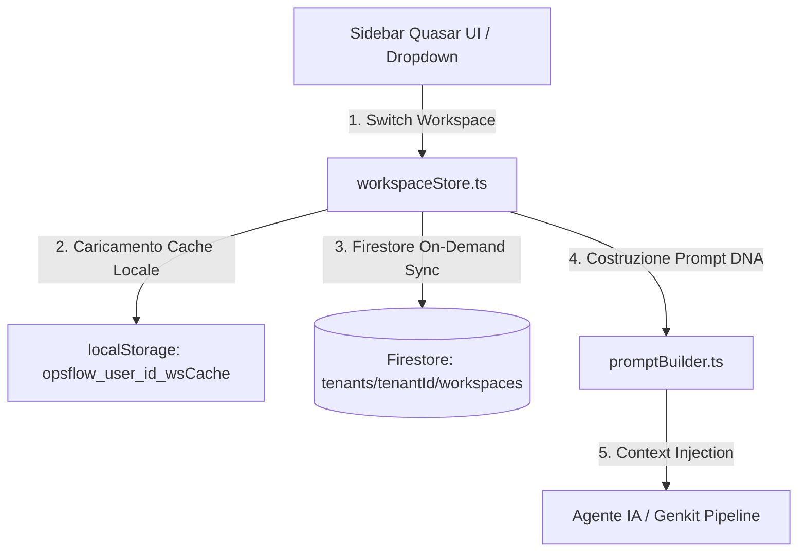
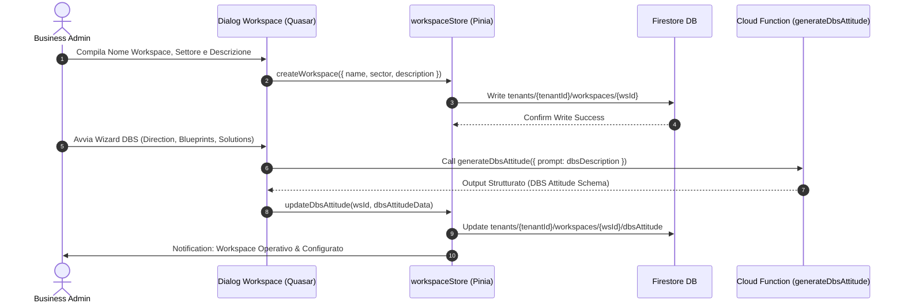
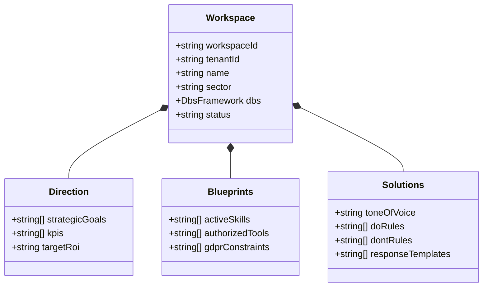
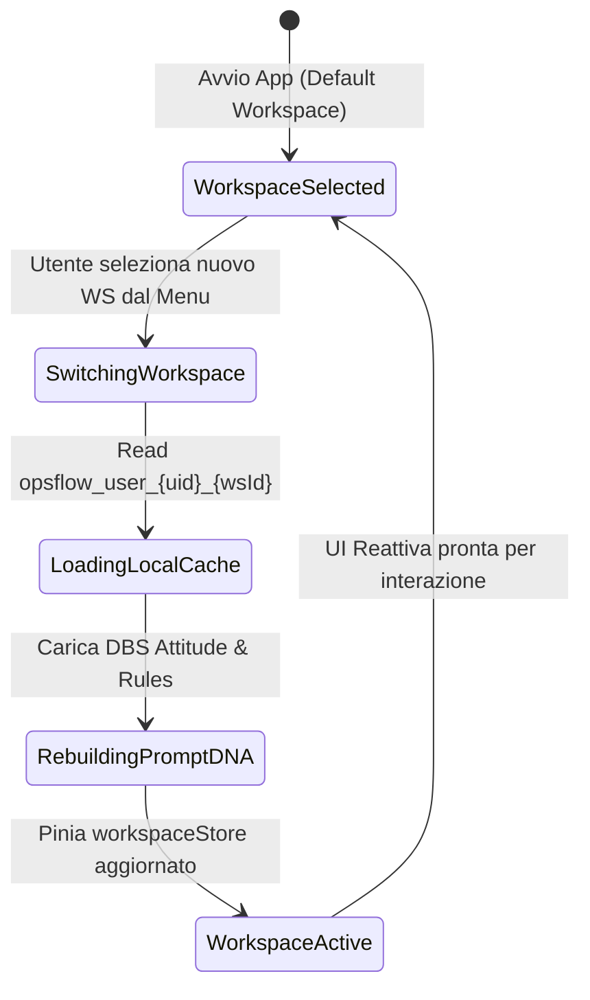

# 🏛️ OpsFlow — Architectural Flow 02: Workspace Lifecycle, DBS Setup & Navigation

> **Componente:** Workspace Provisioning, DBS Framework Configuration & Multi-Workspace Context Switching  
> **Tecnologie:** Vue 3 / Quasar 2, Pinia (`workspaceStore.ts`), Cloud Firestore Multi-Tenant  
> **Standard:** DBS Framework (Direction, Blueprints, Solutions), Zero-Query Cache First (§4, §5 AGENTS.md)  
> **Stato Documento:** Definitivo — Principal Architecture Approved

---

## 📌 1. Panoramica del Flusso Workspace

Un **Workspace** in OpsFlow rappresenta l'ambiente operativo isolato di un team o progetto aziendale. Ciascun workspace risiede all'interno del path tenant-scoped `tenants/{tenantId}/workspaces/{workspaceId}` ed è regolato da una "Costituzione Operativa" basata sul **Framework DBS (Direction, Blueprints, Solutions)**.



---

## 🏢 2. Flusso di Creazione e Configurazione Workspace

### Sequence Diagram: Workspace Setup & DBS Configuration



---

## 🧩 3. Il Framework DBS (Direction, Blueprints, Solutions)

La costituzione di ciascun workspace è articolata sulle **3 Dimensioni DBS**:



### Struttura Modello Firestore: `tenants/{tenantId}/workspaces/{workspaceId}`

```json
{
  "workspaceId": "ws_tech_solutions_01",
  "tenantId": "t_abc123xyz",
  "name": "Software Development Team",
  "sector": "Information Technology",
  "description": "Sviluppo software custom enterprise e integrazione cloud",
  "dbs": {
    "direction": {
      "strategicGoals": ["Ridurre il backlog del 30%", "Incrementare la copertura di test l'80%"],
      "kpis": ["Lead time < 48h", "Zero criticità di sicurezza in produzione"],
      "targetRoi": "300%"
    },
    "blueprints": {
      "activeSkills": ["AgentePlanner", "AgenteIspettore", "AgenteAiEngineer"],
      "authorizedTools": ["webSearchTool", "googleWorkspaceTool"],
      "gdprConstraints": [
        "Crittografia AES-256-GCM client-side",
        "Anonimizzazione PII prima di LLM"
      ]
    },
    "solutions": {
      "toneOfVoice": "Professionale, sintetico, orientato al ROI",
      "doRules": [
        "Fornisci sempre un riepilogo in punti elenco",
        "Richiedi approvazione esplicita prima di inviare email"
      ],
      "dontRules": [
        "Non loggare mai dati PII in chiaro",
        "Non superare il budget di 1.000 token per risposta"
      ],
      "responseTemplates": ["Standard Task Response", "Approval Request Template"]
    }
  },
  "createdAt": "2026-09-02T18:10:00.000Z",
  "updatedAt": "2026-09-02T18:15:00.000Z"
}
```

---

## 🔄 4. Switch e Navigazione tra Workspace Contexts

### Diagramma di Stato Navigazione Tra Workspace



### Strategia di Caching On-Demand & Sync (§5 AGENTS.md)

1. **Namespace Cache Locale:** Salva i dati in `localStorage` o `IndexedDB` con chiave unificata `opsflow_user_{userId}_{dbName}`.
2. **Validità 30 Giorni:** Resiste all'uso offline ed azzera le query Firestore ripetute durante la navigazione.
3. **Firestore-First Write:** Ogni modifica al workspace scrive prima su Firestore e poi aggiorna la cache locale per evitare disallineamenti o perdite dati.

---

## 🏠 5. Home Dashboard & Isolamento Contestuale dell'AI Assistant

### Navigazione & Uscita dal Workspace (`setActiveWorkspace(null)`)

L'architettura supporta la deselezione esplicita del workspace per accedere alla **Panoramica & Home Dashboard** del tenant:

- **Trigger di Navigazione:** Click su "Torna alla Home Dashboard" (header workspace), voce "Panoramica & Profilo" nel Drawer Sinistro, o click sul logo OpsFlow nella Top Navbar.
- **Stato Home Dashboard:** Mostra le credenziali dell'Owner, le metriche aggregate KPI (Workspace attivi, Task totali, Task completati) e la griglia interattiva per la selezione o creazione di nuovi workspace.

### Isolamento di Sicurezza Drawer Destro (`OpsFlow AI Assistant`)

L'assistente nel drawer destro opera **esclusivamente con un contesto workspace valido**:

1. **Visibilità Condizionata (`v-if="selectedWorkspace"`):** Il pulsante di apertura nella navbar e il componente drawer sono renderizzati unicamente se è attivo un workspace.
2. **Auto-Chiusura Reattiva:** Un watcher su `taskStore.activeWorkspaceId` chiude forzatamente il drawer destro (`rightDrawerOpen = false`) nel momento in cui l'utente torna alla Home Dashboard.
3. **Isolamento Cronologia:** Al cambio di workspace (`newId !== oldId`), la cronologia messaggi viene resettata con il prompt DNA e il saluto specifico del nuovo workspace selezionato, azzerando qualsiasi fuga di contesto cross-workspace.
