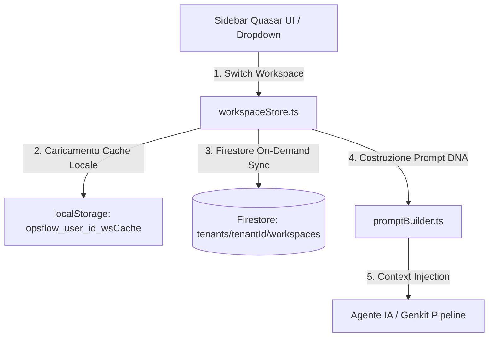
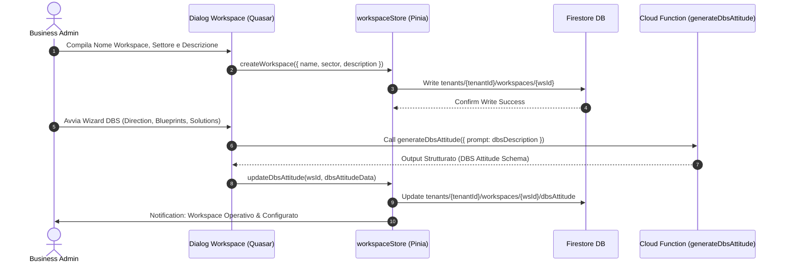
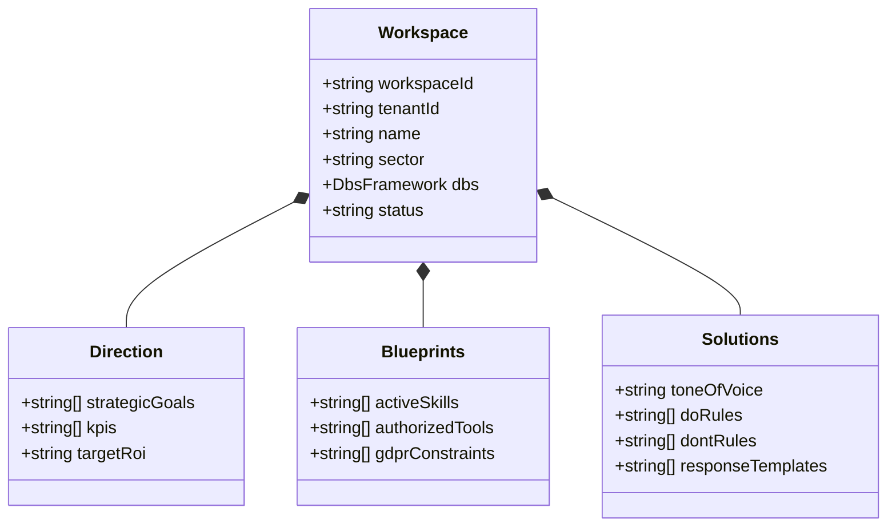
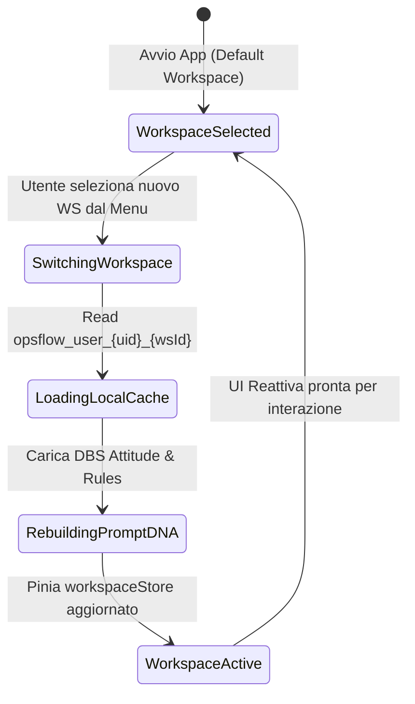

# 🏛️ OpsFlow — Architectural Flow 02: Workspace Lifecycle, DBS Setup & Navigation

> **Componente:** Workspace Provisioning, DBS Framework Configuration & Multi-Workspace Context Switching  
> **Tecnologie:** Vue 3 / Quasar 2, Pinia (`workspaceStore.ts`), Cloud Firestore Multi-Tenant  
> **Standard:** DBS Framework (Direction, Blueprints, Solutions), Zero-Query Cache First (§4, §5 AGENTS.md)  
> **Stato Documento:** Definitivo — Principal Architecture Approved

---

## 📌 1. Panoramica del Flusso Workspace

Un **Workspace** in OpsFlow rappresenta l'ambiente operativo isolato di un team o progetto aziendale. Ciascun workspace risiede all'interno del path tenant-scoped `tenants/{tenantId}/workspaces/{workspaceId}` ed è regolato da una "Costituzione Operativa" basata sul **Framework DBS (Direction, Blueprints, Solutions)**.



---

## 🏢 2. Flusso di Creazione e Configurazione Workspace

### Sequence Diagram: Workspace Setup & DBS Configuration



---

## 🧩 3. Il Framework DBS (Direction, Blueprints, Solutions)

La costituzione di ciascun workspace è articolata sulle **3 Dimensioni DBS**:



### Struttura Modello Firestore: `tenants/{tenantId}/workspaces/{workspaceId}`

```json
{
  "workspaceId": "ws_tech_solutions_01",
  "tenantId": "t_abc123xyz",
  "name": "Software Development Team",
  "sector": "Information Technology",
  "description": "Sviluppo software custom enterprise e integrazione cloud",
  "dbs": {
    "direction": {
      "strategicGoals": ["Ridurre il backlog del 30%", "Incrementare la copertura di test l'80%"],
      "kpis": ["Lead time < 48h", "Zero criticità di sicurezza in produzione"],
      "targetRoi": "300%"
    },
    "blueprints": {
      "activeSkills": ["AgentePlanner", "AgenteIspettore", "AgenteAiEngineer"],
      "authorizedTools": ["webSearchTool", "googleWorkspaceTool"],
      "gdprConstraints": [
        "Crittografia AES-256-GCM client-side",
        "Anonimizzazione PII prima di LLM"
      ]
    },
    "solutions": {
      "toneOfVoice": "Professionale, sintetico, orientato al ROI",
      "doRules": [
        "Fornisci sempre un riepilogo in punti elenco",
        "Richiedi approvazione esplicita prima di inviare email"
      ],
      "dontRules": [
        "Non loggare mai dati PII in chiaro",
        "Non superare il budget di 1.000 token per risposta"
      ],
      "responseTemplates": ["Standard Task Response", "Approval Request Template"]
    }
  },
  "createdAt": "2026-09-02T18:10:00.000Z",
  "updatedAt": "2026-09-02T18:15:00.000Z"
}
```

---

## 🏛️ 3.1 Disaccoppiamento Rigido: AI Attitude (Workspace) vs Task Operativo

OpsFlow impone una rigida separazione ontologica tra la Costituzione del Workspace ed i singoli Task operativi:

| Dimensione                      | AI Attitude del Workspace ("COME CI SI COMPORTA")                                                                                                                    | Task Operativo ("COSA CERCARE / ESEGUIRE")                                                                                                       |
| :------------------------------ | :------------------------------------------------------------------------------------------------------------------------------------------------------------------- | :----------------------------------------------------------------------------------------------------------------------------------------------- |
| **Livello**                     | Livello Workspace (Parent Constitution)                                                                                                                              | Livello Task-Scoped (Single Assignment)                                                                                                          |
| **Scopo**                       | Codice deontologico, metodologia d'indagine (OSINT, X-Ray), tono, vincoli etici e legali.                                                                            | Obiettivo specifico, requisiti tecnici contingenti, logistica e date di consegna.                                                                |
| **Cosa DEVE contenere**         | Regole DO/DON'T anti-allucinazione, forzatura GDPR Art. 14 (+30gg), marcatura dati mancanti come GAP, metodo di estrazione da fonti reali certificate.               | Tecnologie specifiche richieste dal cliente (es. Camunda, Oracle RAC), seniority, budget/tariffa, date evento, sotto-task operative progressive. |
| **Cosa NON deve MAI contenere** | **Dettagli specifici di un singolo incarico** (vietato includere nomi clienti contingenti es. "NobleProg", singole tecnologie o date specifiche es. "28 settembre"). | Regole deontologiche generali o definizioni del tono di voce del team (ereditate automaticamente dal Workspace).                                 |
| **Ciclo di Vita**               | Persistente, riutilizzabile per centinaia di task nello stesso settore/dominio.                                                                                      | Effimero/specifico, generato a partire da email grezze, note informali o bandi cliente.                                                          |

---

## 🛡️ 3.2 Guardrail Anti-Allucinazione Nativo in "Generate DBS Attitude"

Quando l'utente clicca su **"GENERATE DBS ATTITUDE"** in `AIPromptArchitectModal.vue`:

1. La Cloud Function `generateDbsAttitude` (guidata dal prompt `DBS_SYSTEM_PROMPT`) genera la Costituzione del Workspace imponendo deterministicamente:
   - **Neutralità di Dominio:** Non accetta né genera vincoli legati a singole commesse, preservando l'universalità della Costituzione per il settore identificato.
   - **Regole DO Tassative:**
     - Obbligo di raccogliere solo URL reali restituiti dai motori di ricerca certificati.
     - Forzatura automatica della data informativa GDPR Art. 14 a +30 giorni dalla data corrente.
     - Marcatura esplicita di disponibilità, recapiti o tariffe non verificate come "GAP da verificare in chiamata/intervista".
     - Formattazione standard dei contatti ("Contatto via InMail / Profilo Pubblico").
   - **Divieti DON'T Tassativi:**
     - Divieto assoluto di inventare URL 404 dedotti o sintetici.
     - Divieto di generare email fittizie (domini `example.*`, `test.*`, `company.*`) o recapiti telefonici sequenziali/dummy (`1234567`, `0000000`).
     - Divieto di inventare disponibilità, tariffe o competenze non esplicitamente documentate dalle fonti.
2. In UI è attivo per impostazione predefinita il badge/toggle visivo **"🛡️ Strict Ground-Truth / Zero-Hallucination Mode"**.

---

## 🔄 4. Switch e Navigazione tra Workspace Contexts

### Diagramma di Stato Navigazione Tra Workspace



### Strategia di Caching On-Demand & Sync (§5 AGENTS.md)

1. **Namespace Cache Locale:** Salva i dati in `localStorage` o `IndexedDB` con chiave unificata `opsflow_user_{userId}_{dbName}`.
2. **Validità 30 Giorni:** Resiste all'uso offline ed azzera le query Firestore ripetute durante la navigazione.
3. **Firestore-First Write:** Ogni modifica al workspace scrive prima su Firestore e poi aggiorna la cache locale per evitare disallineamenti o perdite dati.

---

## 🏠 5. Home Dashboard & Isolamento Contestuale dell'AI Assistant

### Navigazione & Uscita dal Workspace (`setActiveWorkspace(null)`)

L'architettura supporta la deselezione esplicita del workspace per accedere alla **Panoramica & Home Dashboard** del tenant:

- **Trigger di Navigazione:** Click su "Torna alla Home Dashboard" (header workspace), voce "Panoramica & Profilo" nel Drawer Sinistro, o click sul logo OpsFlow nella Top Navbar.
- **Stato Home Dashboard:** Mostra le credenziali dell'Owner, le metriche aggregate KPI (Workspace attivi, Task totali, Task completati) e la griglia interattiva per la selezione o creazione di nuovi workspace.

### Isolamento di Sicurezza Drawer Destro (`OpsFlow AI Assistant`)

L'assistente nel drawer destro opera **esclusivamente con un contesto workspace valido**:

1. **Visibilità Condizionata (`v-if="selectedWorkspace"`):** Il pulsante di apertura nella navbar e il componente drawer sono renderizzati unicamente se è attivo un workspace.
2. **Auto-Chiusura Reattiva:** Un watcher su `taskStore.activeWorkspaceId` chiude forzatamente il drawer destro (`rightDrawerOpen = false`) nel momento in cui l'utente torna alla Home Dashboard.
3. **Isolamento Cronologia:** Al cambio di workspace (`newId !== oldId`), la cronologia messaggi viene resettata con il prompt DNA e il saluto specifico del nuovo workspace selezionato, azzerando qualsiasi fuga di contesto cross-workspace.

---

## 🌐 6. Hub Risorse Google, Master Sheet & Sincronizzazione Cross-Task (`WorkspaceAttitudeModal.vue`)

### 6.1 Hub Centralizzato Risorse Google per Workspace

In `WorkspaceAttitudeModal.vue` (Tab 2: _Risorse Google Collegate_), OpsFlow gestisce un hub centralizzato di fogli Google e cartelle Drive:

- **Etichette Riconoscibili (Friendly Names):** Le risorse non sono memorizzate come semplici link grezzi opachi, ma con nomi descrittivi specificati dall'utente (es. _"Database Pazienti"_, _"Lead Generation Sanitaria"_, _"Listino Servizi"_).
- **Designazione Master Sheet (⭐):** Un foglio Google può essere designato come **Foglio Principale (Master Database)** del Workspace. L'Agente IA utilizza questo foglio per registrare lo storico delle attività, i KPI e i log operativi generali del team.
- **Firma Istituzionale di Workspace:** Configurazione della firma email aziendale predefinita (`defaultEmailSignature`) ereditabile dinamicamente da tutti i task del workspace.
- **Token Vault Isolato:** L'autenticazione OAuth 2.0 risiede nel token vault isolato server-side (`tenants/{tenantId}/workspaces/{workspaceId}/integrations/google`) protetto da AES-256-GCM.

### 6.2 Sincronizzazione On-The-Fly Cross-Task

Quando un operatore lavora all'interno di un task e incolla un nuovo link o ID di Google Sheets in `TaskSettingsModal.vue`:

1. **Aggancio Locale al Task:** Il foglio viene selezionato come target per le operazioni dell'Agente su quel singolo task (`task.settings.selectedSheetId`).
2. **Propagazione Automatica al Workspace:** Il sistema invoca immediatamente `taskStore.updateWorkspaceLinkedResources(workspaceId, ...)`, registrando il nuovo foglio nell'elenco `linkedSheets` del Workspace sia su Firestore sia nel Pinia store reattivo.
3. **Disponibilità Cross-Task:** Il foglio compare immediatamente nell'elenco risorse di `WorkspaceAttitudeModal.vue` e diventa selezionabile in tutti gli altri task presenti e futuri del Workspace, evitando duplicazioni e frammentazione dei dati.

---

## 👥 7. Gestione Inviti Collaboratori & Modello di Scoping (Workspace-Scoped vs Task-Scoped)

### 7.1 Architettura degli Accessi e Ruoli (RBAC Granulare)

OpsFlow implementa una segregazione degli accessi granulare a due livelli gerarchici:

1. **Accesso a Livello Workspace (`scope: 'workspace'`):**
   - L'amministratore assegna l'utente (`role: 'user'`) all'array `workspace.assignedMembers`.
   - **Visibilità:** L'utente invitato visualizza il Workspace nella sidebar e ha accesso a **TUTTI i task** operativi creati all'interno di quel Workspace.
2. **Accesso Confinato a Singolo Task (`scope: 'task'`):**
   - L'amministratore assegna l'utente all'array `task.assignedMembers` di un task specifico, senza aggiungerlo a `workspace.assignedMembers`.
   - **Visibilità:** L'utente vede il workspace container, ma all'interno della griglia task visualizza **SOLO ed ESCLUSIVAMENTE quel singolo Task**. Tutti gli altri task del workspace rimangono oscurati e inaccessibili via filtro reattivo in `fetchWorkspaceTasks`.
3. **Supervisione Tenant (`owner`, `admin`, `superadmin`):**
   - Mantengono accesso e visibilità globale su tutti i workspace e task del tenant, con poteri di assegnazione, revoca inviti ed esportazione report.

### 7.2 Flusso Operativo UI con `TeamMembersPanel.vue`

Il componente unificato `TeamMembersPanel.vue` si adatta contestualmente in base alle props:

- **Prop `scope`:** `'workspace'` | `'task'` | `'tenant'`.
- **Intestazione Dinamica:**
  - Workspace: _"Membri Workspace: [Nome Workspace]"_ — _"Gestisci l'accesso completo a questo workspace e a tutti i task contenuti"_.
  - Task: _"Accesso Task: [Titolo Task]"_ — _"Invita collaboratori operativi con visibilità limitata esclusivamente a questo task"_.
- **Tab Assegnati vs Tutti i Membri:**
  - Tab _"Membri Assegnati"_: visualizza i collaboratori attivi con badge di ruolo e pulsante di rimozione immediata dall'array `assignedMembers`.
  - Tab _"Tutti i Membri"_: elenca gli utenti del tenant con pulsante rapido `[ + Assegna ]`.
  - Tab _"Invita Nuovo Membro"_: form con inserimento email e selezione ruolo (`user` / `admin`), che invia l'invito crittografico email tramite Cloud Function `createTenantInvitation` e aggiorna contestualmente `assignedMembers`.

### 7.3 Guardie di Quota Freemium (Nuovi Utenti & Collaboratori)

Per garantire la sostenibilità economica dei costi cloud (§5 AGENTS.md):

- **Utente Base (`user`):**
  - Massimo **1 solo Workspace**.
  - Massimo **3 Task** contemporanei (attivi o archiviati).
  - Meccanismo di tolleranza cancellazione: fino a **3 cancellazioni** (massimo **6 task totali nel ciclo vitale**).
  - Al raggiungimento delle soglie: blocco preventivo con notifica esplicativa e invito a collaborare su workspace di tenant aziendali o richiedere upgrade al proprio Admin.
