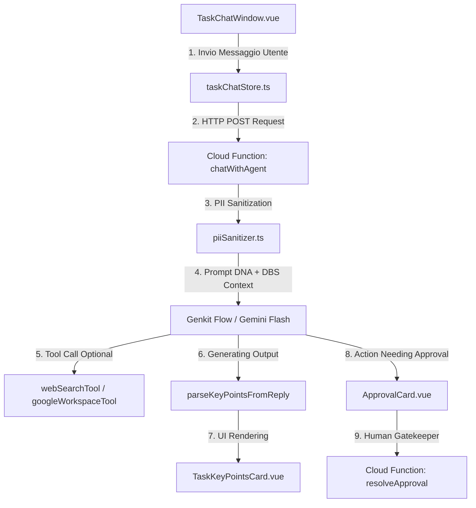
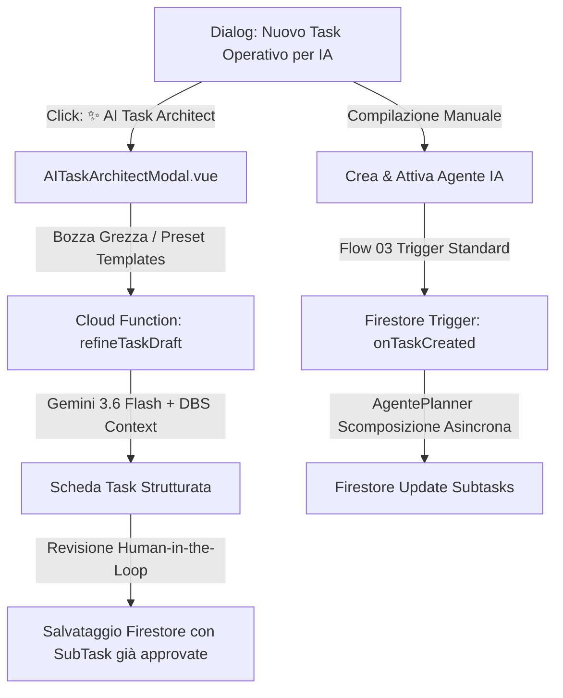
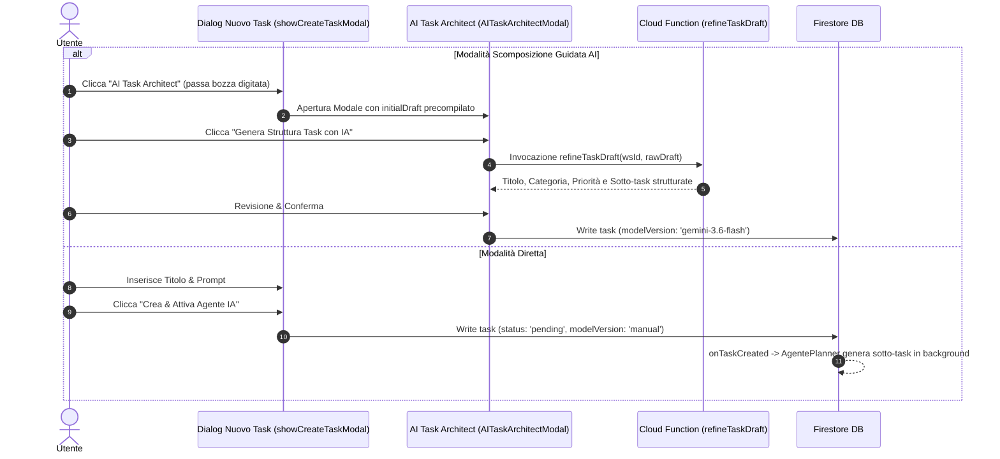
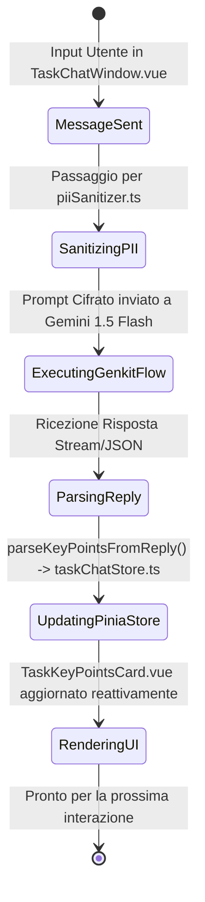
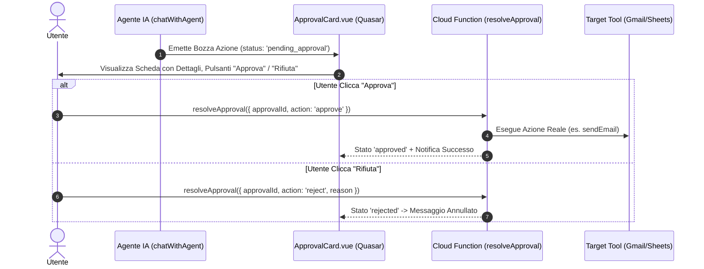

# 🏛️ OpsFlow — Architectural Flow 03: Task Execution, Working Memory & Human-in-the-Loop UI

> **Componente:** Task Management, Interactive Agent Chat Window, Working Memory & Execution Gateways  
> **Tecnologie:** Quasar 2 (`TaskChatWindow.vue`, `TaskKeyPointsCard.vue`, `ApprovalCard.vue`), Pinia (`taskChatStore.ts`), Genkit  
> **Standard:** Direttiva Fondamentale Full-Stack Alignment, Dynamic Working Memory, Human-in-the-Loop (§0, §14 AGENTS.md)  
> **Stato Documento:** Definitivo — Principal Architecture Approved

---

## 📌 1. Panoramica del Flusso Operativo Task

Il ciclo di vita di un Task in OpsFlow collega l'interfaccia utente Quasar con la pipeline agentica Genkit/Gemini. Ogni task risiede in `tenants/{tenantId}/workspaces/{wsId}/tasks/{taskId}` e combina la **Memoria di Lavoro Dinamica** (Sliding Window + Rolling Summary) con schede UI dedicate per l'approvazione ed il controllo dell'utente.



---

## 📋 2. Creazione Task & Integrazione AI Task Architect

### Distinzione di Dominio: Prompt Architect vs Task Architect

OpsFlow separa nettamente gli ambiti agentici:

- **AI Prompt Architect (`AIPromptArchitectModal.vue`):** Agisce a **livello Workspace** per definire Costituzione, Atteggiamento, regole DO/DON'T e Skill Matrix.
- **AI Task Architect (`AITaskArchitectModal.vue`):** Agisce a **livello Task-Scoped**. È integrato direttamente all'interno del dialogo _"Nuovo Task Operativo per IA"_ (`showCreateTaskModal`) e nel dialogo _"Modifica Task"_ (`showEditTaskModal`).



### Sequence Diagram: Flusso Integrato Task Creation



### 2.1 Generatore Task da Email / Input Grezzo ("New Task from Text/Email")

Quando l'operatore riceve un'email o una richiesta non strutturata da un cliente o fornitore (es. bando di ricerca specialisti, richiesta di consulenza, commessa formativa):

1. L'utente incolla il testo integrale grezzo nella textarea di `AITaskArchitectModal.vue`.
2. `refineTaskDraft` elabora il testo incrociandolo con la Costituzione DBS del Workspace (`Level 2`) e produce:
   - **Titolo Sintetico:** Focalizzato sull'azione e sui parametri chiave (es. _"Docente Camunda 8 BPMN | Milano/Remoto"_).
   - **Descrizione Operativa:** Dettaglia contesto, requisiti reali, date e modalità logistica (remoto/presenza).
   - **Sotto-Task Atomiche Progressive:** Scomposizione in 3-5 step operativi sequenziali (es. sourcing profili certificati, verifica requisiti chiave, registrazione foglio con tracciamento fonti, contatto di qualifica).

### 2.2 Gestione Deterministica dei GAP Operativi (Nessuna Allucinazione sui Dati Mancanti)

- Se l'email o l'appunto grezzo non specifica elementi essenziali (es. tariffa oraria/giornaliera, budget, contatti diretti o date esatte), il generatore **NON deve inventare questi dati**.
- I dati mancanti vengono catalogati esplicitamente come **GAP Operativi da verificare** (es. _"Punto da verificare: concordare tariffa in prima chiamata con il cliente/candidato"_).

### 2.3 Integrazione con i Guardrail Backend dello Step 21

Il Task così strutturato fluisce poi nel runtime agentico protetto da:

- `buildStackedPrompt` in `promptBuilder.ts` (Level 1 Base Rules + Level 2 Workspace Attitude + Level 3 Task Instruction).
- `antiHallucinationGuardrail.ts` a valle su ogni operazione tabellare (normalizzazione URL, blocco email fittizie `@example.*`, data GDPR Art. 14 forzata a +30gg).

---

## 💬 3. Ciclo Conversazionale, Memoria di Lavoro & Scheda Punti Chiave

### Il Modello di Memoria Conversazionale a 3 Livelli

Per garantire la massima reattività e costi inferiori a **€1.00/mese per 1.000 utenti** (§5 AGENTS.md), la conversazione si struttura su 3 livelli:

1. **Sliding Window:** Invio al LLM degli ultimi 5 messaggi della conversazione per mantenere il contesto immediato.
2. **Rolling Summary (Punti Chiave):** Sintesi automatica est estratta dai messaggi dell'Agente via Regex parser `parseKeyPointsFromReply()`.
3. **UI Reattiva Isolata:** La scheda `TaskKeyPointsCard.vue` visualizza in tempo reale le informazioni strutturate (Lead, Requisiti, Azioni, Warning, GDPR) senza esporre JSON grezzo all'utente.



### Struttura Dati Punti Chiave (`TaskKeyPointsCard.vue`)

```typescript
export type KeyPointCategory = "leads" | "requirements" | "actions" | "warnings" | "gdpr";

export interface TaskKeyPoint {
  id: string;
  category: KeyPointCategory;
  text: string;
  timestamp: string;
}
```

---

## 🛡️ 4. Human-in-the-Loop & Execution Gate (`ApprovalCard.vue`)

### Direttiva Fondamentale (§0 AGENTS.md)

Nessuna azione di backend ad alto impatto (invio email Gmail, scrittura fogli Google Sheets, modifiche permanenti DB) viene eseguita dall'Agente in modo autonomo. L'Agente produce una **Bozza di Approvazione (Pending Approval Card)**.



---

## 📊 5. Matrice di Stato dei Task

| Stato Task          | Trigger UI                      | Azione Backend / Agente                              | Visibilità Utente                    |
| :------------------ | :------------------------------ | :--------------------------------------------------- | :----------------------------------- |
| `pending`           | Creazione Task                  | Cloud Function `onTaskCreated` genera sotto-task     | Scheda Task neutra con badge grigio  |
| `in_progress`       | Invio Primo Messaggio Chat      | `chatWithAgent` esegue prompt e tool chaining        | Badges reattivi + Rolling Key Points |
| `approval_required` | Agente emette proposta azione   | Generazione record in `tenants/{tenantId}/approvals` | `ApprovalCard.vue` in primo piano    |
| `completed`         | Chiusura Manuale / Ispezione OK | `onTaskUpdated` aziona `AgenteArchivista` per RAG KB | Badge verde + Storico note bloccato  |

---

## ⚙️ 6. Task Settings, Multi-Selezione Google Sheets & Approval Card Avanzata

### 6.1 Configurazione Operativa del Task (`TaskSettingsModal.vue`)

Accessibile mediante il pulsante `[ ⚙️ ]` integrato nell'header di `TaskChatWindow.vue`:

- **Multi-Selezione Fogli Google (`selectedSheetIds`, `selectedSheets`):** L'operatore può selezionare uno o più fogli Google contemporaneamente dalla libreria del Workspace, con supporto ad azioni massive (_"Seleziona tutti"_, _"Deseleziona tutti"_).
- **Designazione Foglio Primario (🎯 Target di Scrittura Predefinito):** Tra i fogli selezionati, un click su `[ Rendi Primario ]` imposta il foglio di destinazione predefinito per le azioni di append automatiche dell'Agente IA.
- **Specifica del Foglio/Tab Interno (`selectedSheetTab`):** L'operatore può specificare una scheda interna personalizzata (es. _"Lead Qualificati"_, _"Report Clinico"_).
- **Creazione Dinamica Automatica del Tab (`addSheet` batchUpdate):** Se la scheda specificata non esiste ancora all'interno del Google Spreadsheet, la Cloud Function `resolveApproval` esegue automaticamente la chiamata `spreadsheets.batchUpdate` con richiesta `addSheet` su Google Sheets API prima dell'inserimento dei dati, eliminando alla radice gli errori 400/404.
- **Firma Email Specifica per Task:** L'operatore può personalizzare la firma usata nelle bozze Gmail generate per il task, oppure cliccare `[ Carica Firma Workspace ]` per ereditare la firma predefinita del team.
- **Collegamento Risorse al Volo:** Incollando un link o ID di foglio Google nel form di aggiunta rapida, il foglio viene sia associato al task sia salvato nel catalogo risorse del Workspace (`linkedSheets`), rendendolo immediatamente riutilizzabile in altri task.

### 6.2 Approval Card Avanzata (`ApprovalCard.vue`) & Selezione Foglio di Destinazione

- **Cambio Foglio al Volo in Approvazione:** Quando l'Agente propone un inserimento o aggiornamento dati su Google Sheets, l'operatore può aprire la modalità modifica e selezionare qualsiasi foglio assegnato al task o al workspace tramite un comodo menu a tendina `q-select`, garantendo pieno controllo su dove andranno a finire i dati.
- **Zero Hardcoded PII (GDPR & Universal Multi-Tenant):** Tutte le stringhe statiche personali sono state completamente rimosse da codice e prompt. I template, le firme e i metadati sono generati dinamicamente dal contesto del tenant.
- **Modalità Espansa a Schermo Intero:** Pulsante `[ ↗ Espandi ]` per visualizzare le bozze Gmail e le tabelle di preview Google Sheets in un dialog Quasar ad alta leggibilità, ottimizzato per audit complessi.
- **Modifica Preventiva dei Dati (Righe & Colonne Dinamiche):** L'operatore può modificare oggetto, destinatari e corpo per le email Gmail. Per i fogli Google Sheets, sia nella card inline che nel dialog a schermo intero _"Ispezione Dati Completa"_, l'operatore può aggiungere ed eliminare non solo righe (`addRow`, `removeRow`), ma anche nuove colonne personalizzate (`addColumn`, `removeColumn`), con allineamento geometrico continuo e propagazione immediata ad `editedPayload.rows` verso `resolveApproval`.
- **Idempotenza & Risoluzione Conflitti:** La Cloud Function `resolveApproval` verifica lo stato del record: se l'azione è già stata approvata o rifiutata da un altro click, restituisce `{ success: true, alreadyResolved: true }` prevenendo errori 409 (Conflict) o crash della UI.

---

## 🔄 7. Dual-Mode AI Task Architect & In-Context Subtask Regeneration

### 7.1 Architettura a Componente Unico Condiviso (`AITaskArchitectModal.vue`)

Per rispettare il principio DRY (Don't Repeat Yourself) e le direttive [AGENTS.md](file:///home/chif-vas/projects/opsflow/AGENTS.md), il componente `AITaskArchitectModal.vue` supporta due distinte modalità operative tramite prop opzionale `existingTask`:

1. **Modalità "Creazione Nuovo Task" (`existingTask == null`):**
   - Invocato dalla Dashboard del Workspace (`src/pages/index.vue`).
   - Trasforma un appunto grezzo o un'email in una nuova scheda task (`taskStore.createTask`).
   - Titolo: _"✨ AI Task Architect | Intelligent Decomposition & Operational Sheet"_.
   - Azione finale: crea un nuovo record su Firestore con `modelVersion: "gemini-3.6-flash"`.

2. **Modalità "Rigenerazione Sotto-Task per Task Aperto" (`existingTask != null`):**
   - Invocato da `TaskSettingsModal.vue` (click su _"✨ Rigenera"_) o dal pannello laterale di `TaskChatWindow.vue`.
   - Pre-popola il prompt e le sotto-task attuali, permettendo all'operatore di raffinare l'obiettivo operativo.
   - Titolo: _"✨ AI Task Architect — Rigenera Sotto-Task | Task: [Titolo]"_.
   - Azione finale: invoca `taskStore.updateTask(workspaceId, existingTask.id, { aiMetadata: { ...subtasks } })` aggiornando **in-place** il task attivo senza creare record duplicati o causare perdite di contesto.
   - Reattività immediata: `TaskChatWindow.vue` intercetta l'evento `taskUpdated` aggiornando istantaneamente l'interfaccia utente (sotto-task operative, indicatori di completamento e timeline).
