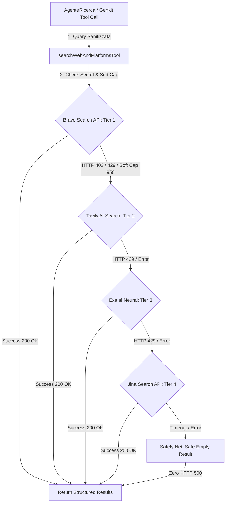
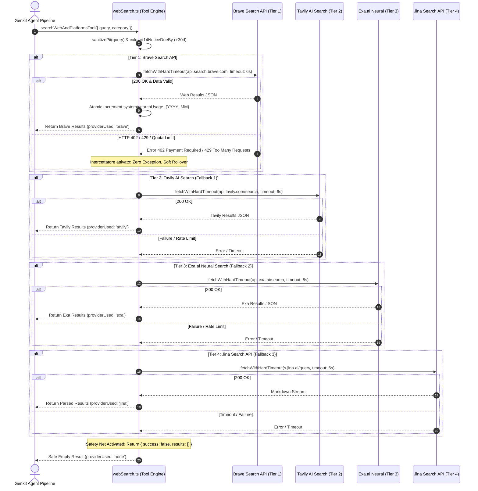
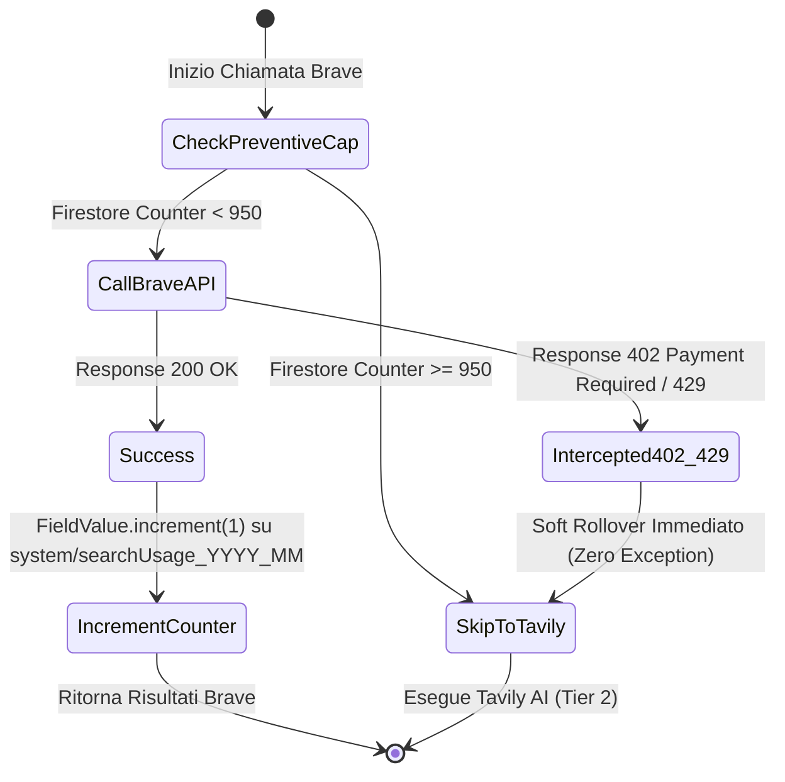
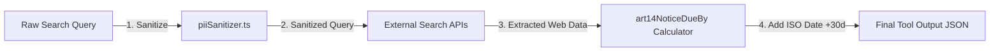

# 🏛️ OpsFlow — Architectural Flow 04: Backend Web Search Engine & Cost Governance

> **Componente:** Web Research Engine, Multi-Provider Fallback Chaining & Double Cost Protection  
> **Tecnologie:** Genkit (`webSearch.ts`), Firebase Cloud Functions Gen 2, GCP Secret Manager  
> **Standard:** Double Cost Guard (Hard Limit $5 + HTTP 402/429 Interceptor + Rolling Quota Guard), GDPR Art. 14 (§3, §5 AGENTS.md)  
> **Stato Documento:** Definitivo — Principal Architecture Approved

---

## 📌 1. Panoramica del Motore di Ricerca

Il motore di ricerca web di **OpsFlow** (`opsflow-functions/src/tools/webSearch.ts`) è progettato per garantire **3.400+ ricerche mensili ad alta accuratezza a costo € 0,00**, azzerando totalmente qualsiasi rischio di errore `HTTP 500` (Zero Crash Guarantee) o addebito incontrollato sulla carta di credito del titolare del SaaS.

---

## ⛓️ 2. Architettura della Catena Multi-Provider (Tier 1 ➔ Safety Net)

### Sequence Diagram: Chaining Sequenziale con Timeout e Fallback

---

## 🛡️ 3. Meccanismo Double Cost Guard su Brave Search API

Per bilanciare lo sfruttamento dei **$5.00 di credito promozionale mensile** di Brave Search API (~1.000 ricerche/mese) ed eliminare qualsiasi rischio di addebito finanziario, l'architettura applica una **doppia barriera di protezione**:

1. **Barriera 1 — Dashboard Brave (Hard Limit $5.00):**  
   Configurazione portale sviluppatori con **Monthly Spending Limit = $5.00** e **Auto-Recharge = OFF**. Al superamento del budget promozionale, l'API Brave rifiuta le chiamate restituendo `HTTP 402` o `HTTP 429` anziché prelevare denaro dalla carta.
2. **Barriera 2 — Backend Interceptor & Counter (`webSearch.ts`):**
   - Intercettazione esplicita degli status `402` e `429`: la funzione restituisce `null` istantaneamente facendo scivolare l'esecuzione su Tavily AI senza rilanciare eccezioni (`throw`).
   - Contatore mensile preventivo su Firestore (`system/searchUsage_{YYYY_MM}`) incrementato atomicamente con `FieldValue.increment(1)`. Raggiunte le 950 chiamate, OpsFlow smette preventivamente di invocare Brave.

---

## ⚖️ 4. GDPR Compliance (Art. 14) & PII Sanitization

### Privacy-by-Design Workflow

- **Sanitizzazione Preventiva:** Ogni query di ricerca viene filtrata da `piiSanitizer.ts` prima dell'uscita verso le API esterne per rimuovere nomi propri, email o codici identificativi (GDPR Art. 32).
- **Tracciamento Informativa GDPR Art. 14:** Rispondendo a requisiti normativi sull'estrazione dati dal web, ogni risultato restituisce il parametro ISO `art14NoticeDueBy` calcolato esattamente a **+30 giorni** dall'estrazione.

---

## ⚙️ 5. Configurazione Infrastrutturale Cloud Functions (Cloud Run 2nd Gen)

Per prevenire timeout, blocchi di memoria o addebiti inutili su istanze inattive, la Cloud Function `chatWithAgent` è configurata secondo i parametri ottimali di governance GCP (§5 AGENTS.md):

| Parametro Cloud Run | Valore Impostato         | Motivazione Architetturale                                                                |
| :------------------ | :----------------------- | :---------------------------------------------------------------------------------------- |
| `region`            | `europe-west1`           | Zero costi di egress verso il database Firestore (stessa regione)                         |
| `memory`            | `1GiB`                   | Garantisce 1 vCPU completa a Cloud Run (elimina il boot timeout su container healthcheck) |
| `timeoutSeconds`    | `60`                     | Elimina la fatturazione su richieste bloccate (ridotto da 300s a 60s)                     |
| `minInstances`      | `0`                      | **Scale-to-Zero:** Costo € 0,00 durante i periodi di inattività                           |
| `maxInstances`      | `10`                     | Hard-Cap per contenere i costi totali sotto il budget target                              |
| `secrets`           | `[BRAVE_SEARCH_API_KEY]` | Iniezione sicura da GCP Secret Manager (Zero secrets in `.env` di produzione)             |
