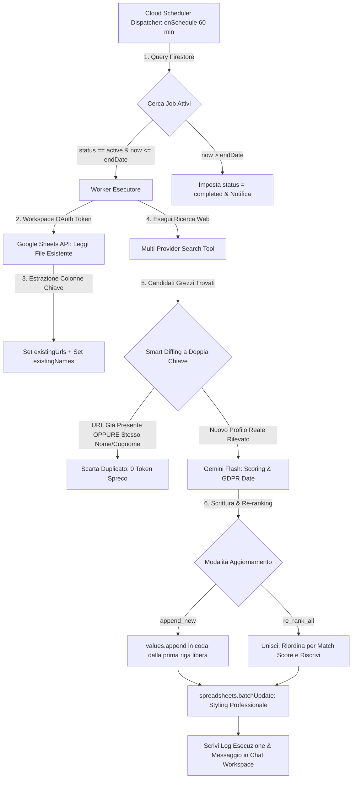
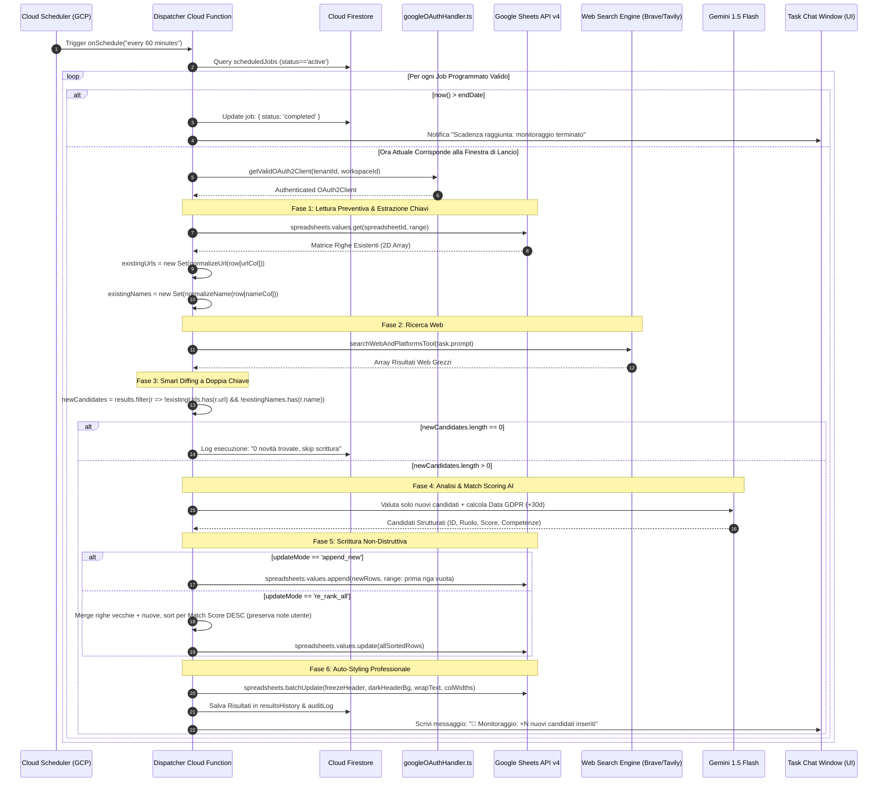
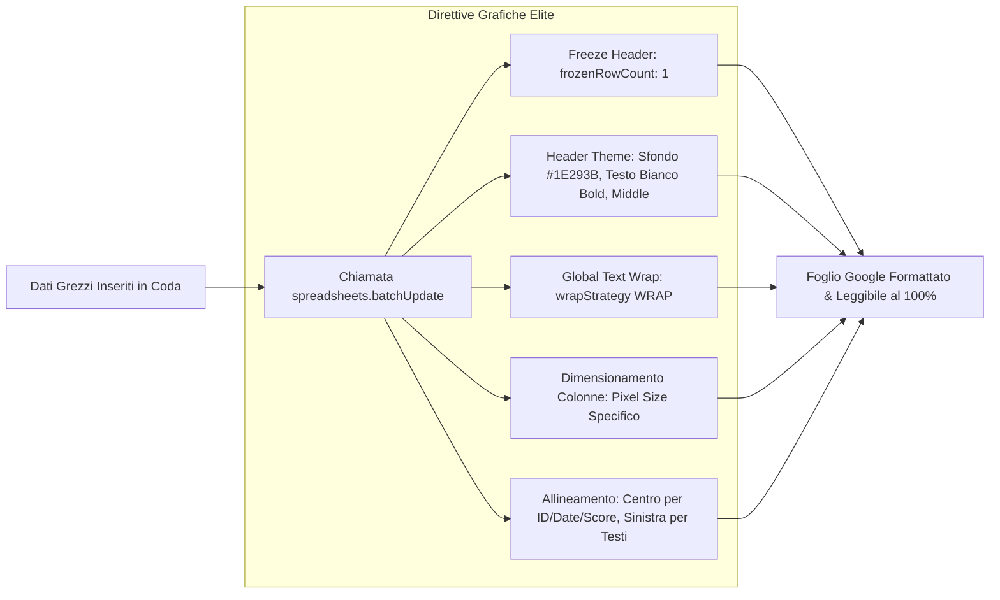

# 🏛️ OpsFlow — Architectural Flow 05: Scheduled Sourcing, Dual-Key Smart Diffing & Sheet Auto-Styling

> **Componente:** Schedulazione Ricerche Ricorrenti, Deduplicazione Preventiva a Doppia Chiave (URL + Nome) e Auto-Styling Fogli Google  
> **Tecnologie:** Firebase Cloud Functions Gen 2 (`onSchedule`), Google Sheets API v4 (`spreadsheets.batchUpdate`), Genkit, Gemini 1.5 Flash, Cloud Firestore  
> **Standard:** Zero Duplicate Guarantee (Cross-Platform), GDPR Art. 14 (+30d auto-notice), Design System Elite, Multi-Tenant Workspace Fenced  
> **Stato Documento:** Definitivo — Principal Architecture Approved

---

## 📌 1. Panoramica del Flusso di Sourcing Programmato

Il flusso di **Scheduled Sourcing & Smart Diffing** consente agli utenti di OpsFlow di automatizzare il monitoraggio periodico di lead, candidati e partner commerciali nel tempo (es. ogni 24 ore alle 04:00 o settimanalmente), interrompendosi tassativamente al raggiungimento della data di scadenza prestabilita (es. 30/12/2026).

Il processo si distingue per l'assoluta efficienza algoritmica: prima di qualsiasi elaborazione AI o scrittura, la Cloud Function **legge il file target esistente**, memorizza in memoria sia gli **URL univoci** sia i **Nomi e Cognomi normalizzati**, e **scarta preventivamente i duplicati cross-piattaforma** (es. stesso professionista trovato una volta su LinkedIn e una volta su Malt), azzerando lo spreco di token e prevenendo contatti ripetuti.

---

## ⛓️ 2. Sequence Diagram: Ciclo Completo di Esecuzione & Diffing

---

## 🎨 3. Flusso Dettagliato di Auto-Styling Google Sheets (`spreadsheets.batchUpdate`)

Quando OpsFlow salva i candidati su Google Sheets, applica una trasformazione visiva coordinata per eguagliare la chiarezza della UI:

### Tabella delle Dimensioni & Allineamenti Colonne:

| Indice | Intestazione Colonna          | Larghezza (px) | Allineamento Orizzontale |  Wrap  |
| :----: | :---------------------------- | :------------: | :----------------------: | :----: |
| **0**  | `ID Candidato`                |    `120 px`    |         `CENTER`         |   No   |
| **1**  | `Nome e Cognome`              |    `160 px`    |          `LEFT`          |   Sì   |
| **2**  | `Ruolo / Specializzazione`    |    `220 px`    |          `LEFT`          |   Sì   |
| **3**  | `Match Score (%)`             |    `110 px`    |         `CENTER`         |   No   |
| **4**  | `Competenze Combacianti`      |    `320 px`    |          `LEFT`          | `WRAP` |
| **5**  | `Gap & Criticità Riscontrate` |    `320 px`    |          `LEFT`          | `WRAP` |
| **6**  | `Data Limite GDPR Art. 14`    |    `130 px`    |         `CENTER`         |   No   |
| **7**  | `Fonte / Profilo Pubblico`    |    `220 px`    |          `LEFT`          |   No   |
| **8**  | `Note Screening & Contatto`   |    `380 px`    |          `LEFT`          | `WRAP` |

---

## 🛡️ 4. Gestione Errori, Resilienza & Privacy (GDPR Art. 14 / Art. 32)

1. **Deduplicazione Cross-Piattaforma:**
   Il controllo verifica sia `normalizeUrl(url)` sia `normalizeName(name)`. Se una persona compare con profili diversi su LinkedIn e Malt, o se la query string cambia, il nome minuscolo e pulito impedisce la re-iscrizione duplicata.
2. **Append Non-Sovrascrivente:**
   In modalità `append_new`, la scrittura inizia sempre dalla prima riga libera disponibile (`A{lastRow + 1}`), lasciando intatte tutte le righe precedentemente approvate e le note manuali.
3. **Gestione Token Scaduto:**
   Se l'operazione su Sheets restituisce `HTTP 401 Unauthorized`, il worker tenta il rinnovo tramite `refreshAccessToken()`. Se fallisce, il job passa in `paused` con errore `oauth_revoked` e viene emesso un avviso in chat.
4. **GDPR Art. 14 Automatic Deadline:**
   Per ogni nuovo candidato reperito tramite fonti pubbliche, il sistema valorizza automaticamente la data limite calcolata a `+30 giorni` dalla data odierna.
