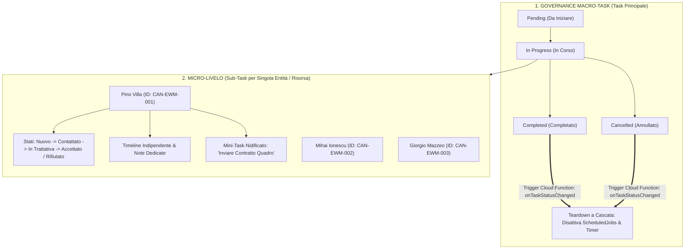
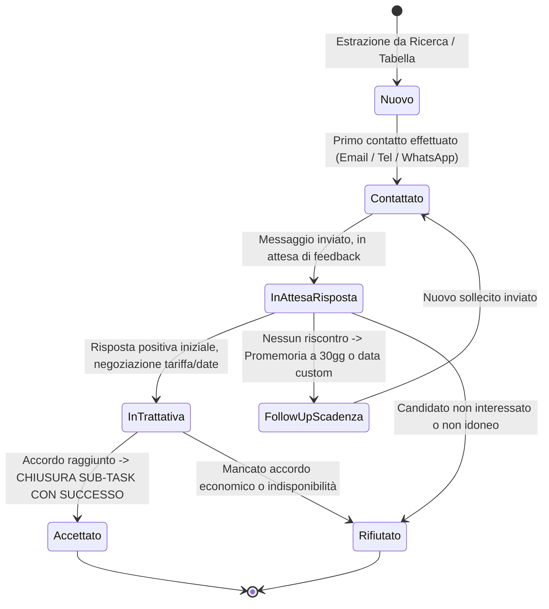
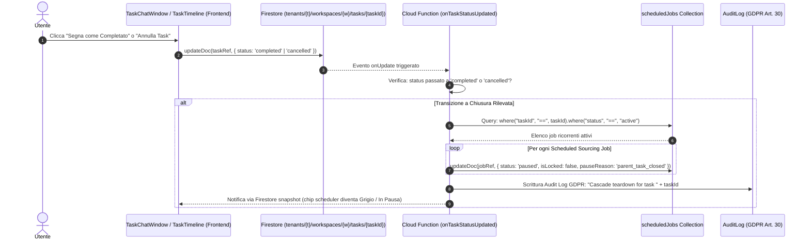
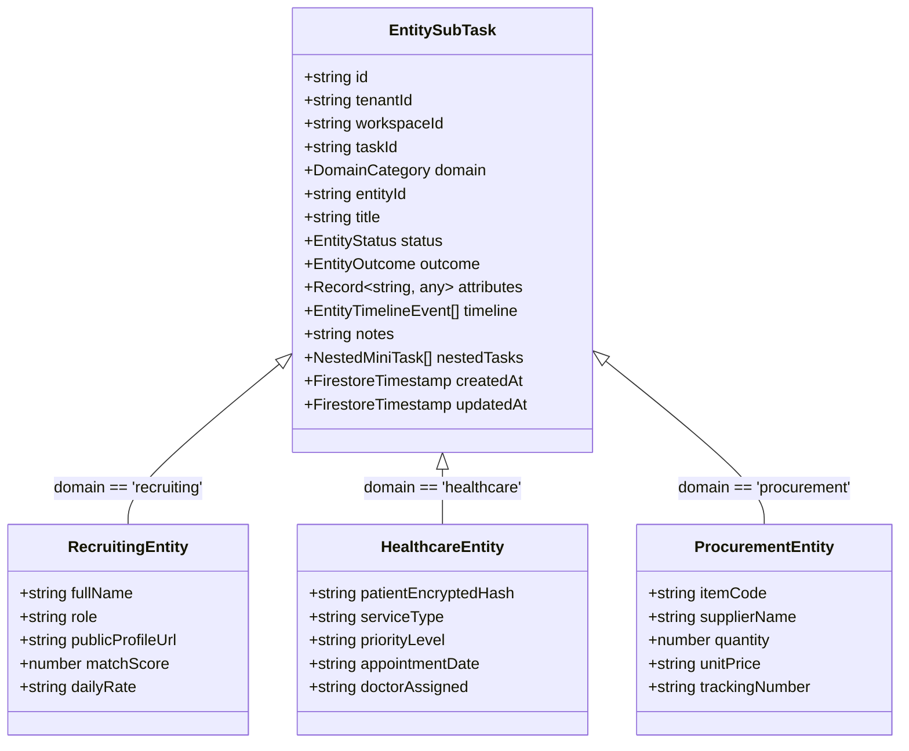

# 🏛️ OpsFlow — Architectural Flow 06: Macro Task & Micro SubTasks Polymorphic Lifecycle

> **Componente:** Macro/Micro State Decoupling, Entity SubTask Lifecycle, Cascade Scheduler Teardown & Multi-Domain Polymorphism  
> **Tecnologie:** Quasar 2 (`TaskChatWindow.vue`, `SubTaskEntityModal.vue`, `EntityTimelineCard.vue`), Pinia (`taskStore.ts`, `taskChatStore.ts`), Cloud Functions (`onTaskStatusUpdated.ts`, `processScheduledSourcingDispatcher.ts`), Firestore  
> **Standard:** Direttiva Fondamentale Full-Stack Alignment, GDPR Art. 5/30/32, Zero-Hallucination DBS, Triple-Pane Layout (§0, §3, §4, §14 AGENTS.md)  
> **Stato Documento:** Definitivo — Principal Architecture Approved

---

## 📌 1. Panoramica del Problema e Soluzione Architetturale

### 1.1 Il Gap Semantico Preesistente (Monolito di Stato)

Nel modello precedente, il Task principale conteneva direttamente stati operativi quali `contacted`, `positive-response`, `negative-response`, `follow-up-30-days`.
Quando un task di sourcing estrae un elenco di risorse (es. 5 consulenti SAP come _Pino Villa, Mihai Ionescu, Giorgio Mazzeo, Andrey Gromov, Franz Rieger_), impostare lo stato del Task su `"Contattato"` o `"In attesa"` causava un grave disallineamento semantico:

- Chiamare 1 persona su 5 non rifletteva lo stato delle altre 4.
- Non era possibile annotare l'esito di ogni singola chiamata né tracciare la cronologia dei singoli contatti.
- La chiusura del task principale non interrompeva in modo deterministico le pianificazioni ricorrenti attive.

### 1.2 La Soluzione: Separazione Decoupled a Due Livelli

OpsFlow adotta una **separazione gerarchica netta**:

1. **Macro-Livello (Task Principale — Governance):** Gestisce il contenitore operativo, lo stato aggregato (`pending`, `in-progress`, `completed`, `cancelled`) e controlla a cascata i timer e i Cloud Scheduler.
2. **Micro-Livello (Sub-Task / Entity Item — Esecuzione Granulare):** Ogni persona, prestazione sanitaria o materiale estratto possiede una propria scheda operativa con stati dedicati, timeline indipendente, note e possibilità di generare ulteriori mini-task nidificati.



---

## 🔄 2. Macchina a Stati Decoupled & Regole di Transizione

### 2.1 Stati del Task Principale (Macro-Livello)

Il Task principale governa esclusivamente l'avanzamento complessivo del progetto:

| Stato Macro   | Descrizione                                                                 | Effetto sui Timer & Scheduler                                    |
| :------------ | :-------------------------------------------------------------------------- | :--------------------------------------------------------------- |
| `pending`     | Task creato, in attesa di primo avvio o scomposizione AI                    | Scheduler inattivo / programmato                                 |
| `in-progress` | Task operativo, chat attiva, ricerche o sourcing in esecuzione              | Scheduler e timer operativi                                      |
| `completed`   | Obiettivo del task raggiunto (es. trovato il profilo / chiusa la selezione) | **Spegnimento immediato a cascata di TUTTI i timer e scheduler** |
| `cancelled`   | Task abbandonato o scartato manualmente dall'utente                         | **Spegnimento immediato a cascata di TUTTI i timer e scheduler** |

### 2.2 Stati del Sub-Task / Entità Operativa (Micro-Livello)

Ogni singola risorsa identificata nel task (candidato, prestazione, ordine) attraversa una macchina a stati dedicata:



- **Chiusura per Accettazione (`accepted`):** Quando la risorsa accetta la proposta, il sub-task viene contrassegnato come `completed` con esito positivo (`outcome: "won"`).
- **Chiusura per Rifiuto (`rejected`):** Se la risorsa rifiuta, il sub-task viene archiviato come completato con esito negativo (`outcome: "lost"`), preservando note e motivo del rifiuto per l'audit futuro.

---

## 🛑 3. Teardown a Cascata: Spegnimento Scheduler & Timer

Quando il Task Principale transita in stato `completed` o `cancelled`:



> **Regola Vincente:** Anche se un `ScheduledSourcingJob` ha una data di fine validità lontana nel tempo (es. 31/12/2026), la chiusura del Macro-Task lo disattiva **immediatamente**, garantendo **Zero Costi Cloud Inutili (§5 AGENTS.md)** e piena aderenza al principio di limitazione della conservazione dei dati (GDPR Art. 5).

---

## 🖥️ 4. Flusso UX/UI: Generazione e Gestione del Sub-Task

### 4.1 Punti di Accesso per l'Apertura del Sub-Task

L'utente può aprire o generare la scheda Sub-Task dell'entità da due punti chiave dell'interfaccia:

1. **Dalla Tabella dei Risultati (Google Sheets Preview o Chat KeyPoints Card):**
   - Clic sul nome della persona (es. _Pino Villa_) o sull'icona rapida `open_in_new` / `assignment_ind` nella riga della tabella.
2. **Dalla Timeline del Task Principale:**
   - Clic sull'evento di estrazione o aggiunta della persona per espandere il dettaglio o aprire direttamente il Sub-Task.

### 4.2 Anatomia della Finestra Dedicata (`SubTaskEntityModal.vue`)

La finestra o drawer del Sub-Task segue il **Design System Elite (Navy/Gold/Matita §6)** ed è strutturata in 4 macro-aree:

```
┌─────────────────────────────────────────────────────────────────────────────┐
│ 👤 PINO VILLA — Senior SAP EWM Consultant                [🎯 In Trattativa ▼]│
│ ID: CAN-EWM-001  |  Fonte: LinkedIn Sourcing  |  Task: Sourcing SAP EWM     │
├──────────────────────────────────────┬──────────────────────────────────────┤
│ 📋 DETTAGLI & CONTESTO EREDITATO     │ 🕒 TIMELINE DEDICATA DELL'ENTITÀ    │
│ • Competenze: SAP EWM, S/4HANA       │ 14 Set, 10:30 — Estratto da ricerca │
│ • Tariffa indicativa: 550€/giorno    │ 14 Set, 11:15 — Primo contatto WA    │
│ • Profilo: linkedin.com/in/...       │ 14 Set, 16:00 — Risposta: disponibile│
│                                      │                                      │
│ 📝 NOTE OPERATIVE (Auto-Save)        │ ➕ REGISTRA EVENTO RAPIDO            │
│ ┌──────────────────────────────────┐ │ [Chiamata] [Email] [WhatsApp] [Nota]│
│ │ Richiede smart working 80%.     │ │                                      │
│ │ Disponibile da Ottobre 2026.    │ │ ⚡ MINI-TASK NIDIFICATO              │
│ └──────────────────────────────────┘ │ [ ] Inviare NDA quadro entro giovedì │
├──────────────────────────────────────┴──────────────────────────────────────┤
│ [❌ Rifiuta / Archivia]             [⭐ Accetta & Concludi Sub-Task]        │
└─────────────────────────────────────────────────────────────────────────────┘
```

---

## 💡 5. I 4 Dettagli Operativi Fondamentali (Linee Guida di Esecuzione)

### 5.1 Creazione Batch Automatica dall'Estrazione (Auto-Generation on Approval)

Quando l'agente individua i candidati e genera la tabella (es. i 5 profili trovati nella chat), la creazione dei rispettivi record `EntitySubTask` avviene in **automatico** nel momento in cui l'utente clicca su `"Approve & Execute"` della card di Google Sheets (`manageGoogleSheetTool` / `ApprovalCard.vue` $\rightarrow$ `resolveApproval`).

- Il backend parsa le righe approvate e genera in batch i documenti in `tasks/{taskId}/subtasks/`.
- Vengono ereditati immediatamente: Nome, Ruolo, Score, URL profilo, Competenze e Note di ricerca.
- Si elimina l'esigenza di creare manualmente 5 sub-task uno alla volta.

### 5.2 Reopening Safety & Rollback (Nessuna riattivazione alla cieca)

Se un utente completa per errore o annulla il macro-task e successivamente lo riporta a `in-progress`:

- I job ricorrenti messi in pausa (`scheduledJobs`) **NON si riattivano automaticamente alla cieca**.
- Il sistema mostra un dialog informativo e non bloccante:  
  _"Il task è stato riaperto: desideri riattivare anche la ricerca programmata notturna?"_
- Solo su conferma esplicita dell'utente il flag dello scheduler torna su `active`.

### 5.3 Isolamento di Stato & Sync Monodirezionale (No conflitti con Google Sheets)

Gli stati operativi (`new`, `contacted`, `waiting_response`, `negotiation`, `won`, `lost`):

- Vivono e si aggiornano **esclusivamente all'interno di OpsFlow** nel componente `SubTaskEntityModal.vue`.
- Non viene eseguita alcuna scrittura continua/bidirezionale sulle singole celle del Foglio Google ad ogni cambio di stato o telefonata.
- **Vantaggi:** Elimina race condition, previene disallineamenti di indici di riga in caso di modifiche manuali su Sheets ed azzera i rischi di saturazione delle quote API di Google Sheets.

### 5.4 Macro Rollup & Notifica di Chiusura Consapevole

Quando tutti i sub-task collegati al task raggiungono un esito finale definitivo (`won` oppure `lost`):

- Il sistema **NON forza mai la chiusura automatica a sorpresa** del Macro Task.
- Mostra un banner/notifica elegante e non invasivo:  
  _"Tutte le risorse sono state gestite. Vuoi completare e archiviare il task principale?"_
- L'utente mantiene il controllo sovrano ("Human-in-the-Loop") prima che parta il teardown a cascata.

---

## 🌐 6. Astrazione Polimorfica Multi-Dominio

Il sistema modella il Sub-Task in modo generico (`EntitySubTask`), rendendolo utilizzabile senza modifiche strutturali in domini operativi differenti:



### Tabella degli Stati per Dominio Applicativo

| Dominio                  | Identificativo Entità         | Workflow di Stato (Micro-Livello)                                                            | Chiusura Positiva (`outcome: 'won'`)        |
| :----------------------- | :---------------------------- | :------------------------------------------------------------------------------------------- | :------------------------------------------ |
| **HR / Recruiting**      | Candidato / Trainer           | `new` $\rightarrow$ `contacted` $\rightarrow$ `waiting_response` $\rightarrow$ `negotiation` | Candidato inserito / contratto firmato      |
| **Sanità / Ambulatorio** | Paziente / Prestazione        | `triaged` $\rightarrow$ `scheduled` $\rightarrow$ `in_examination` $\rightarrow$ `reporting` | Visita eseguita e refertata (GDPR Art. 9)   |
| **Procurement**          | Ordine Fornitore / Articolo   | `rfq_sent` $\rightarrow$ `order_placed` $\rightarrow$ `in_transit` $\rightarrow$ `customs`   | Materiale collaudato e ricevuto a magazzino |
| **Operations**           | Ticket Impianto / Macchinario | `assigned` $\rightarrow$ `diagnosing` $\rightarrow$ `parts_waiting` $\rightarrow$ `testing`  | Riparazione completata e certificata        |

---

## 💾 7. Modello Dati Firestore & Schemi TypeScript

### 7.1 Path Firestore

I Sub-Task risiedono in una sotto-collezione isolata per garantire scalabilità e query veloci:

```
tenants/{tenantId}/workspaces/{workspaceId}/tasks/{taskId}/subtasks/{subtaskId}
```

### 7.2 Schema TypeScript Proposto (in `src/types/models.ts`)

```typescript
/** Allowed macro statuses for primary OpsFlow tasks */
export type MacroTaskStatus = "pending" | "in-progress" | "completed" | "cancelled";

/** Granular operational status for per-entity Sub-Tasks */
export type EntitySubTaskStatus =
  | "new"
  | "contacted"
  | "waiting_response"
  | "negotiation"
  | "positive_response"
  | "negative_response"
  | "follow_up"
  | "completed";

/** Final business outcome of the Sub-Task */
export type EntitySubTaskOutcome = "in_progress" | "won" | "lost" | "cancelled";

/** Event recorded within an entity's private timeline */
export interface EntityTimelineEvent {
  id: string;
  eventType: "status_change" | "call" | "email" | "whatsapp" | "note" | "mini_task";
  title: string;
  description?: string;
  authorId: string;
  authorName: string;
  timestamp: string; // ISO 8601
}

/** Nested mini-action inside an entity Sub-Task */
export interface NestedMiniTask {
  id: string;
  title: string;
  completed: boolean;
  dueDate?: string;
  assignedTo?: string;
}

/** Complete Polymorphic Entity SubTask Model */
export interface EntitySubTask {
  id: string;
  tenantId: string;
  workspaceId: string;
  taskId: string;
  domain: "recruiting" | "healthcare" | "procurement" | "operations" | "generic";

  /** Visual identification */
  title: string; // es. "Pino Villa" oppure "Dott. Bianchi - Visita Cardiologica"
  subtitle?: string; // es. "Senior SAP EWM Consultant"
  entityExternalId?: string; // es. "CAN-EWM-001"

  /** State machine */
  status: EntitySubTaskStatus;
  outcome: EntitySubTaskOutcome;

  /** Dynamic context inherited from table/chat */
  contextSnippet?: string;
  attributes: Record<string, unknown>;

  /** Private timeline and notes */
  notes: string;
  timeline: EntityTimelineEvent[];
  nestedTasks: NestedMiniTask[];

  /** Timestamps */
  createdAt: string;
  updatedAt: string;
}
```

---

## 🔒 8. Sicurezza, Privacy & GDPR (Healthcare & PII)

1. **GDPR Art. 9 & Client-Side Encryption (Sanità):**  
   Se `domain === 'healthcare'`, i dati anagrafici del paziente contenuti in `attributes` o nelle `notes` devono essere cifrati client-side con AES-256-GCM prima della persistenza su Firestore (§3 AGENTS.md).
2. **GDPR Art. 5 (Data Minimization & Storage Limitation):**  
   Il cascade teardown garantisce che nessun processo automatico o Cloud Scheduler rimanga orfano o continui a scandagliare profili per task già completati o annullati.
3. **GDPR Art. 30 (Audit Logs):**  
   Ogni cambio di stato dell'entità (`status_change`) e ogni operazione di cascade teardown genera un evento strutturato nel log di audit del tenant.

---

## 🏁 9. Allineamento con Flussi Esistenti

- **Collegamento con Flow 03 (`03_task_execution_and_ui_flow.md`):**  
  La generazione di Sub-Task estende il meccanismo dei `TaskKeyPointsCard.vue`, permettendo all'utente di trasformare con un click ogni riga di risultato in un `EntitySubTask` operativo.
- **Collegamento con Flow 05 (`05_scheduled_sourcing_and_smart_diffing_flow.md`):**  
  Il Dual-Key Diffing continua ad alimentare il Google Sheet, ma quando l'utente visiona i nuovi profili in OpsFlow, può gestire i contatti tramite la scheda persona senza inquinare lo stato macro del task.
