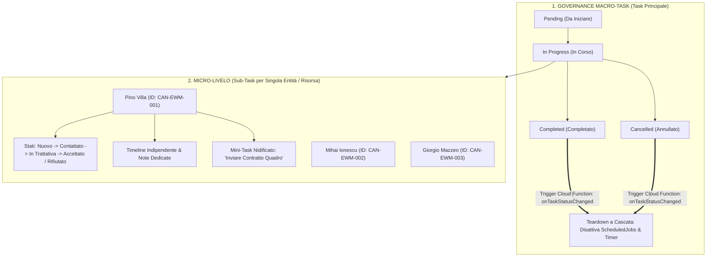
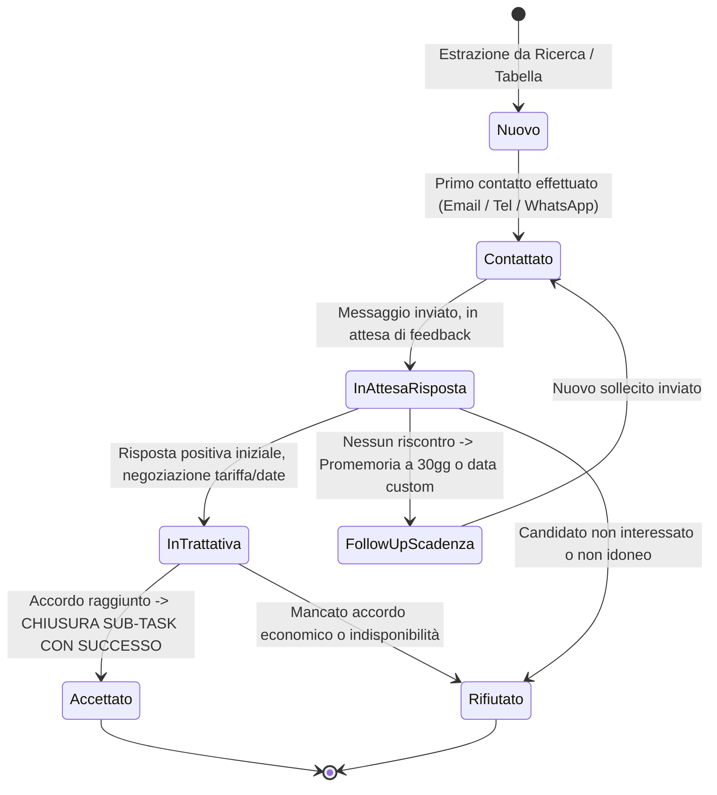
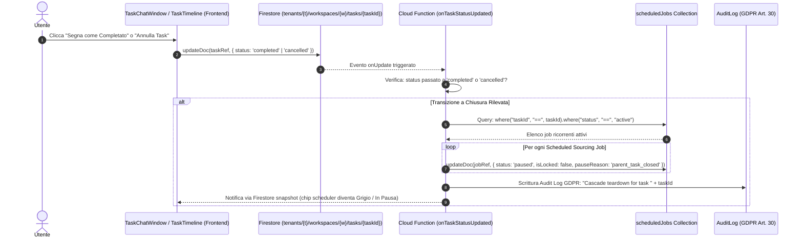
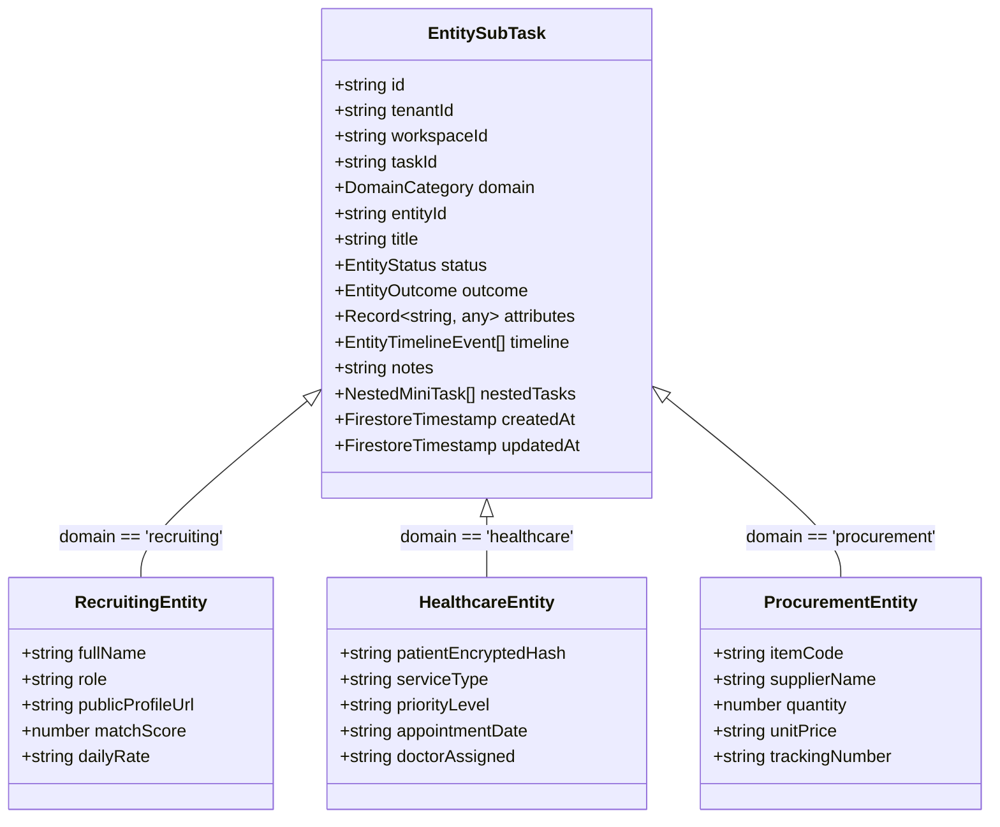

# 🏛️ OpsFlow — Architectural Flow 06: Macro Task & Micro SubTasks Polymorphic Lifecycle

> **Componente:** Macro/Micro State Decoupling, Entity SubTask Lifecycle, Cascade Scheduler Teardown & Multi-Domain Polymorphism  
> **Tecnologie:** Quasar 2 (`TaskChatWindow.vue`, `SubTaskEntityModal.vue`, `EntityTimelineCard.vue`), Pinia (`taskStore.ts`, `taskChatStore.ts`), Cloud Functions (`onTaskStatusUpdated.ts`, `processScheduledSourcingDispatcher.ts`), Firestore  
> **Standard:** Direttiva Fondamentale Full-Stack Alignment, GDPR Art. 5/30/32, Zero-Hallucination DBS, Triple-Pane Layout (§0, §3, §4, §14 AGENTS.md)  
> **Stato Documento:** Definitivo — Principal Architecture Approved

---

## 📌 1. Panoramica del Problema e Soluzione Architetturale

### 1.1 Il Gap Semantico Preesistente (Monolito di Stato)

Nel modello precedente, il Task principale conteneva direttamente stati operativi quali `contacted`, `positive-response`, `negative-response`, `follow-up-30-days`.
Quando un task di sourcing estrae un elenco di risorse (es. 5 consulenti SAP come _Pino Villa, Mihai Ionescu, Giorgio Mazzeo, Andrey Gromov, Franz Rieger_), impostare lo stato del Task su `"Contattato"` o `"In attesa"` causava un grave disallineamento semantico:

- Chiamare 1 persona su 5 non rifletteva lo stato delle altre 4.
- Non era possibile annotare l'esito di ogni singola chiamata né tracciare la cronologia dei singoli contatti.
- La chiusura del task principale non interrompeva in modo deterministico le pianificazioni ricorrenti attive.

### 1.2 La Soluzione: Separazione Decoupled a Due Livelli

OpsFlow adotta una **separazione gerarchica netta**:

1. **Macro-Livello (Task Principale — Governance):** Gestisce il contenitore operativo, lo stato aggregato (`pending`, `in-progress`, `completed`, `cancelled`) e controlla a cascata i timer e i Cloud Scheduler.
2. **Micro-Livello (Sub-Task / Entity Item — Esecuzione Granulare):** Ogni persona, prestazione sanitaria o materiale estratto possiede una propria scheda operativa con stati dedicati, timeline indipendente, note e possibilità di generare ulteriori mini-task nidificati.



---

## 🔄 2. Macchina a Stati Decoupled & Regole di Transizione

### 2.1 Stati del Task Principale (Macro-Livello)

Il Task principale governa esclusivamente l'avanzamento complessivo del progetto:

| Stato Macro   | Descrizione                                                                 | Effetto sui Timer & Scheduler                                    |
| :------------ | :-------------------------------------------------------------------------- | :--------------------------------------------------------------- |
| `pending`     | Task creato, in attesa di primo avvio o scomposizione AI                    | Scheduler inattivo / programmato                                 |
| `in-progress` | Task operativo, chat attiva, ricerche o sourcing in esecuzione              | Scheduler e timer operativi                                      |
| `completed`   | Obiettivo del task raggiunto (es. trovato il profilo / chiusa la selezione) | **Spegnimento immediato a cascata di TUTTI i timer e scheduler** |
| `cancelled`   | Task abbandonato o scartato manualmente dall'utente                         | **Spegnimento immediato a cascata di TUTTI i timer e scheduler** |

### 2.2 Stati del Sub-Task / Entità Operativa (Micro-Livello)

Ogni singola risorsa identificata nel task (candidato, prestazione, ordine) attraversa una macchina a stati dedicata:



- **Chiusura per Accettazione (`accepted`):** Quando la risorsa accetta la proposta, il sub-task viene contrassegnato come `completed` con esito positivo (`outcome: "won"`).
- **Chiusura per Rifiuto (`rejected`):** Se la risorsa rifiuta, il sub-task viene archiviato come completato con esito negativo (`outcome: "lost"`), preservando note e motivo del rifiuto per l'audit futuro.

---

## 🛑 3. Teardown a Cascata: Spegnimento Scheduler & Timer

Quando il Task Principale transita in stato `completed` o `cancelled`:



> **Regola Vincente:** Anche se un `ScheduledSourcingJob` ha una data di fine validità lontana nel tempo (es. 31/12/2026), la chiusura del Macro-Task lo disattiva **immediatamente**, garantendo **Zero Costi Cloud Inutili (§5 AGENTS.md)** e piena aderenza al principio di limitazione della conservazione dei dati (GDPR Art. 5).

---

## 🖥️ 4. Flusso UX/UI: Generazione e Gestione del Sub-Task (I 3 Miglioramenti Architetturali)

### 4.1 Sub-Task Integrati nel Nodo "In Progress" della Timeline (Punto 1 — Ergonomia Senza Disordine)

Nel modello iniziale, il banner _"Risorse & Sub-Task Operativi"_ era posizionato all'interno dell'area chat. Man mano che l'utente e l'agente IA dialogavano o venivano prodotte tabelle estese, la card veniva inesorabilmente spinta verso l'alto scomparendo dalla vista (_"out of sight, out of mind"_).

**L'Architettura Adottata:**
Il cruscotto operativo dei Sub-Task è stato rimosso dall'area chat e integrato in modo nativo direttamente all'interno dell'evento attivo corrente **"In Progress (Stato aggiornato a In Progress)"** nel pannello destro _"Timeline Stati"_ (`TaskChatWindow.vue`), replicato specularmente anche nella vista timeline a tutta pagina (`viewMode === 'timeline'`).

```
┌─────────────────────────────────────────────────────────────────────────────┐
│ 🕒 TIMELINE STATI (Pannello Laterale / Vista Full Timeline)                 │
│                                                                             │
│  ○  Pending — Task creato dal sistema o dall'utente                        │
│  ●  IN PROGRESS — STATO ATTIVO CORRENTE                                     │
│  │                                                                          │
│  │  ┌────────────────────────────────────────────────────────────────────┐  │
│  │  │ 👥 SUB-TASK OPERATIVI                                [ 2/5 Conclusi ]│ │
│  │  ├────────────────────────────────────────────────────────────────────┤  │
│  │  │ [➕ Nuova Risorsa] [📊 Sheets] [✉️ Email]                 [🔄 Ricarica]│  │
│  │  ├────────────────────────────────────────────────────────────────────┤  │
│  │  │ 👤 Davide Benvenuti — Senior Oracle DBA         [In Trattativa] [>] │  │
│  │  │ 👤 Giorgio Roncacci — Oracle Cloud Architect    [Contattato]    [>] │  │
│  │  │ 👤 Marco Ferrari — Exadata Specialist           [Won ⭐]        [>] │  │
│  │  └────────────────────────────────────────────────────────────────────┘  │
│  ○  Completed — Obiettivo raggiunto (Teardown a cascata scheduler)         │
└─────────────────────────────────────────────────────────────────────────────┘
```

- **Contatore e Stato Dinamico:** Badge `(conclusi/totale)` con calcolo reattivo su esiti `won`, `lost` o `completed`.
- **Action Bar Rapida Integrata:**
  - `[+ Nuova Risorsa]`: Apre all'istante la modale intelligente di estrazione dati (`CreateSubtaskModal.vue`).
  - `[📊 Sheets]`: Apre il Google Sheet collegato al task in una nuova scheda del browser oppure istruisce l'Agente AI a sincronizzare le righe.
  - `[✉️ Email]`: Invia un prompt guidato all'Agente AI per generare una bozza di email formale di contatto per i profili monitorati.
  - `[🔄 Ricarica]`: Sincronizzazione on-demand della sotto-collezione Firestore `subtasks`.
- **Lista Compatta e Reattiva:** Ciascuna riga mostra l'avatar tematico del dominio (`medical_services`, `inventory_2`, `precision_manufacturing`, `person`), il nome dell'entità, il ruolo/categoria, i badge di stato/esito e l'icona chevron. Il click sull'intera riga apre istantaneamente la modale di dettaglio `SubTaskEntityModal.vue`.
- **Vantaggio Operativo:** L'area Chat a sinistra rimane pulita al 100% per conversare con l'Agente IA, mentre il cruscotto di controllo operativo rimane visibile e fermo a schermo sulla destra.

---

### 4.2 Dialog "Nuova Risorsa" Intelligente con Pre-fill da Chat/Sheets/Email (Punto 2 — Zero-Effort Data Ingestion)

Il vecchio prompt a riga singola vuota costringeva l'operatore a ricordare o copiare e incollare manualmente nomi, ruoli e contatti che l'IA o le tabelle avevano già individuato.

**L'Architettura Adottata (`CreateSubtaskModal.vue`):**
La modale propone un'interfaccia fluida a schermata unica con estrazione dinamica guidata dall'operatore:

```
┌─────────────────────────────────────────────────────────────────────────────┐
│ ➕ NUOVA RISORSA / SUB-TASK OPERATIVO                                     [✕]│
│ Monitora contatti, esiti e timeline dedicati per questa entità              │
├─────────────────────────────────────────────────────────────────────────────┤
│ 🔗 SORGENTE DATI                                                            │
│ Origine: [ 📑 Foglio Google (A2:G10 — 5 righe) ▼ ] [ Riga 1: D. Benvenuti ▼]│
│ ┌─────────────────────────────────────────────────────────────────────────┐ │
│ │ 💡 Colonne disponibili: [Nome: Davide] [Ruolo: DBA] [Email: d@ex.com]   │ │
│ │ [LinkedIn: in/dbenv] [Tariffa: 600€] [⚡ Mappa Tutti i Campi]           │ │
│ └─────────────────────────────────────────────────────────────────────────┘ │
│                                                                             │
│ Nome Risorsa: [ Davide Benvenuti                             ]              │
│ Ruolo / Specializzazione: [ Senior Oracle DBA                ]              │
│ Email: [ d.benvenuti@example.com ]  Telefono: [ +39 340 ...  ]              │
│ LinkedIn / Profilo Web: [ https://linkedin.com/in/dbenvenuti ]              │
│ Dominio: [ Recruiting & HR ] (ereditato dal Task principale)                │
│ Note Operative: [ Specialista certificato OCP, tariffa 600€/giorno ]        │
├─────────────────────────────────────────────────────────────────────────────┤
│ [Annulla]                                      [➕ Crea Scheda Risorsa]     │
└─────────────────────────────────────────────────────────────────────────────┘
```

1. **Schermata Unica Integrata & Flessibile (Zero Tab):**
   - Eliminazione dei due tab separati per evitare frammentazioni e falsi profili rilevati alla cieca.
   - L'operatore visualizza un'interfaccia unica in cui ha il controllo totale sulla sorgente di dati da cui attingere.

2. **Selettore Intelligente di Sorgente Guidato dall'Utente:**
   - **Tabelle Chat (Markdown):** Rileva le tabelle con colonne e righe generate dall'Agente nella conversazione.
   - **Risposte / Valutazioni Agente (Analisi di Profilo):** Riconosce i report di valutazione strutturati (es. _Ruolo/Profilo, Location, Competenze, Gap, Compliance_) trattandoli come attributi/colonne di un unico profilo da importare, senza scambiare i titoli dei bullet per persone diverse.
   - **Fogli Google (Sheets / Excel):** Ispeziona le card di approvazione `manageGoogleSheetTool` e permette di selezionare riga per riga i dati da importare.
   - **Bozze Email:** Rileva le proposte di contatto create da `sendGmailDraftTool`.
   - **Inserimento 100% Libero:** Per creare rapidamente una risorsa digitando direttamente i campi a mano.

3. **Ispezione Visuale delle Colonne & 1-Click Auto-Mapping:**
   - Le celle della riga o i campi della risposta compaiono come **chip interattive**.
   - Con il pulsante `[⚡ Mappa Tutti i Campi]`, l'algoritmo semantico assegna automaticamente Nome, Ruolo, Email, LinkedIn e aggiunge i dettagli tecnici (Location, Competenze, Tariffa) alle note operative.
   - Cliccando su una singola chip, compare un menu a tendina per assegnare quel valore a uno specifico campo form o aggiungerlo alle note.

4. **Campi Operativi Dedicati & Note 100% Manuali:**
   - Campo Nome a tutta larghezza (`col-12`).
   - Campi dedicati per Email, LinkedIn e Telefono.
   - Dominio ereditato automaticamente con badge discreto.
   - Textarea per Note Operative sempre libera e modificabile a mano senza sovrascritture impreviste.

5. **Persistenza Atomica su Firestore (`EntitySubTask`):**
   - La risorsa viene salvata direttamente nella sotto-collezione `tenants/{t}/workspaces/{w}/tasks/{taskId}/subtasks/{subtaskId}`.
   - Viene creato il primo evento nella timeline privata (`eventType: 'status_change'`, status iniziale `'new'`).
   - Gli attributi memorizzano `email`, `profileUrl`, `contactInfo`, `extractedRow` e `headers`, garantendo la visualizzazione completa in `SubTaskEntityModal.vue`.

---

### 4.3 Layout Split-View & Persistenza Locale nello Store Pinia (Punto 3 — Vista Sinottica)

L'impostazione precedente basata su 4 tab orizzontali mutui escludenti (_Dati_, _Note_, _Timeline_, _Mini-Task_) frammentava le informazioni costringendo l'operatore a continui click avanti e indietro.

**L'Architettura Adottata (`SubTaskEntityModal.vue` & `subtaskUiStore.ts`):**
La modale (larghezza 1060px) adotta il paradigma **Two-Column Split-View**, speculare all'ergonomia apprezzata nella finestra principale del task:

```
┌─────────────────────────────────────────────────────────────────────────────────────────────────┐
│ 👤 DAVIDE BENVENUTI — Senior Oracle DBA                                     [🎯 In Trattativa ▼]│
│ ID: CAN-ORA-001  |  Dominio: Recruiting  |  Task Principale: Sourcing Oracle Specialist      [✕]│
├──────────────────────────────────────────────┬──────────────────────────────────────────────────┤
│ 📋 COLONNA SINISTRA: DATI & NOTE             │ 🕒 COLONNA DESTRA: MINI-TASK & TIMELINE          │
│                                              │                                                  │
│ 📌 Profilo & Dati Ereditati                  │ ⚡ Mini-Task Operativi (1/2)          [▲ Comprimi]│
│ • Contatti: d.benvenuti@example.com          │ [x] Inviare questionario tecnico preliminare     │
│ • LinkedIn: linkedin.com/in/dbenvenuti       │ [ ] Richiedere referenze progetti bancari        │
│ • Snippet: Specialista OCP, 15 anni exp      │ [+ Aggiungi Mini-Task]                           │
│                                              │ ──────────────────────────────────────────────── │
│ 📝 Note Operative (Auto-Save con debounce)   │ 🕒 Timeline Privata Risorsa                      │
│ ┌──────────────────────────────────────────┐ │ Registra: [📞 Call] [✉️ Mail] [💬 WA] [📝 Nota] │
│ │ Tariffa richiesta: 600€/giorno.          │ │                                                  │
│ │ Colloquio fissato per martedì ore 15:00. │ │ ● 14 Set, 11:30 — Inviata email con tariffa     │
│ └──────────────────────────────────────────┘ │   da Vasile Chifeac (Email)                      │
│                                              │ ● 14 Set, 10:15 — Primo contatto su WhatsApp     │
│ [⭐ Segna come Won]    [❌ Segna come Lost] │ ● 14 Set, 09:30 — Risorsa estratta dalla ricerca │
└──────────────────────────────────────────────┴──────────────────────────────────────────────────┘
```

1. **Colonna Sinistra (Dati Ereditati, Note & Azioni Definitive):**
   - Informazioni anagrafiche e di contatto estratte, attributi custom e snippet contestuale.
   - Textarea per Note Operative persistite con auto-salvataggio automatico debounced (500ms) e indicatore visivo di stato (_"Salvataggio..."_ / _"Salvato"_).
   - Action Bar di esito definitivo con bottoni ad alto contrasto: `[⭐ Segna come Won]` (accordo raggiunto, chiude come vinto) e `[❌ Segna come Lost]` (rifiuto o non idoneità con motivazione tracciata).
2. **Colonna Destra (Checklist Mini-Task & Timeline Privata):**
   - **Mini-Task Checklist:** Checklist rapida con checkbox, inserimento a riga singola con invio rapido, contatore `(completati/totali)` e pulsante per collassare o espandere la sezione.
   - **Timeline Privata Eventi:** Visualizzazione verticale fedele allo stile del Task Principale (Img 5), con pallini colorati per tipo di interazione (`call`, `email`, `whatsapp`, `status_change`, `note`, `mini_task`), orari relativi, badge dell'autore e corpo dell'evento.
   - **Quick Action Logger:** Bottoni rapidi `[📞 Chiamata]`, `[✉️ Email]`, `[💬 WhatsApp]`, `[📝 Nota]` che aprono una card contestuale per registrare una telefonata o messaggio in 3 secondi.
3. **Persistenza Locale dello Stato UI (`subtaskUiStore.ts` — §5 AGENTS.md):**
   - Per non appesantire la visualizzazione su monitor compatti, la checklist dei mini-task è impostata di default come collassata (`isMiniTasksExpanded = false`).
   - Nel momento in cui l'utente espande o chiude il pannello o regola il separatore (`splitterRatio`), lo store Pinia salva automaticamente lo stato in `localStorage` con la chiave `opsflow_subtask_ui_state`.
   - **Zero Costi Cloud:** Nessuna interrogazione (`getDoc`/`setDoc`) a Firestore per salvare la preferenza UI. Alla riapertura di qualsiasi sub-task del workspace, la modale si apre esattamente con il layout preferito dall'utente.

---

### 4.4 Eliminazione Definitiva del Sub-Task (Firestore & Store Locale)

In caso di apertura o creazione accidentale di un Sub-Task, l'operatore può eliminarlo definitivamente senza lasciare record orfani né nel database né nell'interfaccia.

**Punti di Cancellazione:**

1. **Dalla Lista nel Nodo Timeline (`TaskChatWindow.vue`):** Ciascuna riga del sub-task presenta un'icona cestino dedicata (`delete_outline`). Il click apre un dialog di conferma persistente.
2. **Dalla Modale di Dettaglio (`SubTaskEntityModal.vue`):** L'utente può eliminare la risorsa sia tramite l'icona rapida nell'Header Elite (`delete_forever`), sia tramite il pulsante dedicato nel Footer (_"Elimina Sub-Task"_).

**Sequenza di Esecuzione:**

- **Dialog di Conferma:** Conferma esplicita con avviso che l'operazione rimuoverà la risorsa in modo permanente.
- **Cancellazione Firestore:** Invocazione atomica di `deleteDoc(docRef)` sulla sotto-collezione `tenants/{t}/workspaces/{w}/tasks/{taskId}/subtasks/{subtaskId}`.
- **Pulizia Reattiva Locale:** Rimozione immediata dall'array `subtasks.value` in memoria locale e chiusura della modale (`selectedSubtask.value = null`), garantendo aggiornamento istantaneo del contatore e della UI senza necessità di ricaricare la pagina.

---

## 💡 5. I 4 Dettagli Operativi Fondamentali (Linee Guida di Esecuzione)

### 5.1 Creazione Batch Automatica dall'Estrazione (Auto-Generation on Approval)

Quando l'agente individua i candidati e genera la tabella (es. i 5 profili trovati nella chat), la creazione dei rispettivi record `EntitySubTask` avviene in **automatico** nel momento in cui l'utente clicca su `"Approve & Execute"` della card di Google Sheets (`manageGoogleSheetTool` / `ApprovalCard.vue` $\rightarrow$ `resolveApproval`).

- Il backend parsa le righe approvate e genera in batch i documenti in `tasks/{taskId}/subtasks/`.
- Vengono ereditati immediatamente: Nome, Ruolo, Score, URL profilo, Competenze e Note di ricerca.
- Si elimina l'esigenza di creare manualmente 5 sub-task uno alla volta.

### 5.2 Reopening Safety & Rollback (Nessuna riattivazione alla cieca)

Se un utente completa per errore o annulla il macro-task e successivamente lo riporta a `in-progress`:

- I job ricorrenti messi in pausa (`scheduledJobs`) **NON si riattivano automaticamente alla cieca**.
- Il sistema mostra un dialog informativo e non bloccante:  
  _"Il task è stato riaperto: desideri riattivare anche la ricerca programmata notturna?"_
- Solo su conferma esplicita dell'utente il flag dello scheduler torna su `active`.

### 5.3 Isolamento di Stato & Sync Monodirezionale (No conflitti con Google Sheets)

Gli stati operativi (`new`, `contacted`, `waiting_response`, `negotiation`, `won`, `lost`):

- Vivono e si aggiornano **esclusivamente all'interno di OpsFlow** nel componente `SubTaskEntityModal.vue`.
- Non viene eseguita alcuna scrittura continua/bidirezionale sulle singole celle del Foglio Google ad ogni cambio di stato o telefonata.
- **Vantaggi:** Elimina race condition, previene disallineamenti di indici di riga in caso di modifiche manuali su Sheets ed azzera i rischi di saturazione delle quote API di Google Sheets.

### 5.4 Macro Rollup & Notifica di Chiusura Consapevole

Quando tutti i sub-task collegati al task raggiungono un esito finale definitivo (`won` oppure `lost`):

- Il sistema **NON forza mai la chiusura automatica a sorpresa** del Macro Task.
- Mostra un banner/notifica elegante e non invasivo:  
  _"Tutte le risorse sono state gestite. Vuoi completare e archiviare il task principale?"_
- L'utente mantiene il controllo sovrano ("Human-in-the-Loop") prima che parta il teardown a cascata.

---

## 🌐 6. Astrazione Polimorfica Multi-Dominio

Il sistema modella il Sub-Task in modo generico (`EntitySubTask`), rendendolo utilizzabile senza modifiche strutturali in domini operativi differenti:



### Tabella degli Stati per Dominio Applicativo

| Dominio                  | Identificativo Entità         | Workflow di Stato (Micro-Livello)                                                            | Chiusura Positiva (`outcome: 'won'`)        |
| :----------------------- | :---------------------------- | :------------------------------------------------------------------------------------------- | :------------------------------------------ |
| **HR / Recruiting**      | Candidato / Trainer           | `new` $\rightarrow$ `contacted` $\rightarrow$ `waiting_response` $\rightarrow$ `negotiation` | Candidato inserito / contratto firmato      |
| **Sanità / Ambulatorio** | Paziente / Prestazione        | `triaged` $\rightarrow$ `scheduled` $\rightarrow$ `in_examination` $\rightarrow$ `reporting` | Visita eseguita e refertata (GDPR Art. 9)   |
| **Procurement**          | Ordine Fornitore / Articolo   | `rfq_sent` $\rightarrow$ `order_placed` $\rightarrow$ `in_transit` $\rightarrow$ `customs`   | Materiale collaudato e ricevuto a magazzino |
| **Operations**           | Ticket Impianto / Macchinario | `assigned` $\rightarrow$ `diagnosing` $\rightarrow$ `parts_waiting` $\rightarrow$ `testing`  | Riparazione completata e certificata        |

---

## 💾 7. Modello Dati Firestore & Schemi TypeScript

### 7.1 Path Firestore

I Sub-Task risiedono in una sotto-collezione isolata per garantire scalabilità e query veloci:

```
tenants/{tenantId}/workspaces/{workspaceId}/tasks/{taskId}/subtasks/{subtaskId}
```

### 7.2 Schema TypeScript Proposto (in `src/types/models.ts`)

```typescript
/** Allowed macro statuses for primary OpsFlow tasks */
export type MacroTaskStatus = "pending" | "in-progress" | "completed" | "cancelled";

/** Granular operational status for per-entity Sub-Tasks */
export type EntitySubTaskStatus =
  | "new"
  | "contacted"
  | "waiting_response"
  | "negotiation"
  | "positive_response"
  | "negative_response"
  | "follow_up"
  | "completed";

/** Final business outcome of the Sub-Task */
export type EntitySubTaskOutcome = "in_progress" | "won" | "lost" | "cancelled";

/** Event recorded within an entity's private timeline */
export interface EntityTimelineEvent {
  id: string;
  eventType: "status_change" | "call" | "email" | "whatsapp" | "note" | "mini_task";
  title: string;
  description?: string;
  authorId: string;
  authorName: string;
  timestamp: string; // ISO 8601
}

/** Nested mini-action inside an entity Sub-Task */
export interface NestedMiniTask {
  id: string;
  title: string;
  completed: boolean;
  dueDate?: string;
  assignedTo?: string;
}

/** Complete Polymorphic Entity SubTask Model */
export interface EntitySubTask {
  id: string;
  tenantId: string;
  workspaceId: string;
  taskId: string;
  domain: "recruiting" | "healthcare" | "procurement" | "operations" | "generic";

  /** Visual identification */
  title: string; // es. "Pino Villa" oppure "Dott. Bianchi - Visita Cardiologica"
  subtitle?: string; // es. "Senior SAP EWM Consultant"
  entityExternalId?: string; // es. "CAN-EWM-001"

  /** State machine */
  status: EntitySubTaskStatus;
  outcome: EntitySubTaskOutcome;

  /** Dynamic context inherited from table/chat */
  contextSnippet?: string;
  attributes: Record<string, unknown>;

  /** Private timeline and notes */
  notes: string;
  timeline: EntityTimelineEvent[];
  nestedTasks: NestedMiniTask[];

  /** Timestamps */
  createdAt: string;
  updatedAt: string;
}
```

---

## 🔒 8. Sicurezza, Privacy & GDPR (Healthcare & PII)

1. **GDPR Art. 9 & Client-Side Encryption (Sanità):**  
   Se `domain === 'healthcare'`, i dati anagrafici del paziente contenuti in `attributes` o nelle `notes` devono essere cifrati client-side con AES-256-GCM prima della persistenza su Firestore (§3 AGENTS.md).
2. **GDPR Art. 5 (Data Minimization & Storage Limitation):**  
   Il cascade teardown garantisce che nessun processo automatico o Cloud Scheduler rimanga orfano o continui a scandagliare profili per task già completati o annullati.
3. **GDPR Art. 30 (Audit Logs):**  
   Ogni cambio di stato dell'entità (`status_change`) e ogni operazione di cascade teardown genera un evento strutturato nel log di audit del tenant.

---

## 🏁 9. Allineamento con Flussi Esistenti

- **Collegamento con Flow 03 (`03_task_execution_and_ui_flow.md`):**  
  La generazione di Sub-Task estende il meccanismo dei `TaskKeyPointsCard.vue`, permettendo all'utente di trasformare con un click ogni riga di risultato in un `EntitySubTask` operativo.
- **Collegamento con Flow 05 (`05_scheduled_sourcing_and_smart_diffing_flow.md`):**  
  Il Dual-Key Diffing continua ad alimentare il Google Sheet, ma quando l'utente visiona i nuovi profili in OpsFlow, può gestire i contatti tramite la scheda persona senza inquinare lo stato macro del task.
