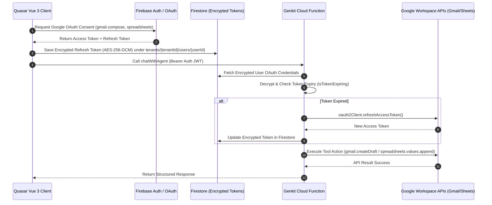

# 🏛️ OpsFlow — Global Master Architect Review & Code Blueprint

> **System Architecture Standard:** Modern Distributed SaaS Architecture (Notion / Linear / Cursor Standard)  
> **Target Platform:** OpsFlow Operational Intelligence SaaS  
> **Author:** Principal AI Software Architect & Distributed Systems Engineer  
> **Date:** August 13, 2026

---

## Executive Summary & Core Operational Fixes

This document establishes the production-grade architectural blueprint for **OpsFlow**, solving the three primary friction points in the current implementation:

1. **Bulletproof Google Workspace OAuth & Tool Execution:** End-to-end token verification, automatic refresh token rotation, AES-256-GCM encryption at rest, and explicit error handling for Gmail and Google Sheets APIs.
2. **Interactive "Human-in-the-Loop" Rich UI Cards:** Structured preview cards for tool outputs with `[✅ Approve & Execute]` and `[❌ Reject]` controls before triggering external writes.
3. **Zero-Loss Realtime State Synchronization:** Dual-layer state sync combining Firestore subcollection `onSnapshot` listeners, Pinia `Map<string, ChatSession>` state management, and `localStorage` fallback to survive page refreshes (F5).

---

## 1. Bulletproof Google Workspace OAuth & Tool Execution Pattern

### 1.1 Architecture & Token Lifecycle Flow



### 1.2 Production Server-Side Token Handler (`opsflow-functions/src/tools/googleOAuthHandler.ts`)

```typescript
/**
 * @file googleOAuthHandler.ts
 * @description Secure Google Workspace OAuth token verification and refresh manager.
 * @author Vasile Chifeac
 * @created 2026-08-13
 */

import { google } from "googleapis";
import * as admin from "firebase-admin";
import { decryptAES256GCM, encryptAES256GCM } from "../ai/piiSanitizer";

export interface GoogleTokenCredentials {
  accessToken: string;
  refreshToken: string;
  expiryDate: number;
  scopes: string[];
}

/**
 * Retrieves and automatically refreshes user OAuth2 client for Google Workspace APIs.
 * @param {string} tenantId - Tenant ID for multi-tenant isolation
 * @param {string} userId - User UID
 * @returns {Promise<any>} Authenticated google.auth.OAuth2 instance
 */
export async function getAuthenticatedOAuth2Client(tenantId: string, userId: string): Promise<any> {
  const db = admin.firestore();
  const tokenDocRef = db.doc(`tenants/${tenantId}/users/${userId}/tokens/google`);
  const snap = await tokenDocRef.get();

  if (!snap.exists) {
    throw new Error("GOOGLE_AUTH_REQUIRED: User has not granted Google Workspace permissions.");
  }

  const data = snap.data();
  const decryptedRefreshToken = decryptAES256GCM(data.encryptedRefreshToken);
  const decryptedAccessToken = decryptAES256GCM(data.encryptedAccessToken);

  const clientId = process.env.GOOGLE_CLIENT_ID;
  const clientSecret = process.env.GOOGLE_CLIENT_SECRET;

  if (!clientId || !clientSecret) {
    throw new Error("SERVER_CONFIG_ERROR: Missing GOOGLE_CLIENT_ID or GOOGLE_CLIENT_SECRET.");
  }

  const oauth2Client = new google.auth.OAuth2(clientId, clientSecret);
  oauth2Client.setCredentials({
    access_token: decryptedAccessToken,
    refresh_token: decryptedRefreshToken,
    expiry_date: data.expiryDate,
  });

  // Check if access token is expired or expires within 5 minutes (300,000 ms)
  const isExpired = !data.expiryDate || Date.now() >= data.expiryDate - 300000;

  if (isExpired) {
    try {
      const { credentials } = await oauth2Client.refreshAccessToken();
      const updatedAccessToken = credentials.access_token;
      const updatedExpiry = credentials.expiry_date || Date.now() + 3600 * 1000;

      if (updatedAccessToken) {
        await tokenDocRef.update({
          encryptedAccessToken: encryptAES256GCM(updatedAccessToken),
          expiryDate: updatedExpiry,
          updatedAt: admin.firestore.FieldValue.serverTimestamp(),
        });
      }
    } catch (refreshErr: any) {
      throw new Error(
        `GOOGLE_TOKEN_REFRESH_FAILED: ${refreshErr.message || "Invalid Refresh Token"}`,
      );
    }
  }

  return oauth2Client;
} /*end getAuthenticatedOAuth2Client*/
```

---

## 2. Interactive "Human-in-the-Loop" Rich UI Card Pattern

### 2.1 Pending Action Interface Schema (`src/types/models.ts`)

```typescript
// ── Pending Action Schema (Human-in-the-Loop) ────────────────────────────────
export type PendingActionType = "create_gmail_draft" | "update_google_sheet" | "platform_sourcing";
export type PendingActionStatus = "pending" | "approved" | "rejected" | "executed";

export interface PendingActionPayload {
  targetEmail?: string;
  subject?: string;
  bodyText?: string;
  sheetId?: string;
  sheetName?: string;
  rows?: string[][];
  platforms?: Array<{
    name: string;
    url: string;
    description: string;
    matchScore: number;
  }>;
}

export interface PendingAction {
  id: string;
  actionType: PendingActionType;
  status: PendingActionStatus;
  payload: PendingActionPayload;
  createdAt: string;
  executedAt?: string;
}
```

### 2.2 Task Chat Store Pending Action Handlers (`src/stores/taskChatStore.ts`)

```typescript
/**
 * Approves and executes a pending tool action in the chat thread.
 */
async function approveAndExecuteAction(
  taskId: string,
  messageId: string,
  actionId: string,
): Promise<void> {
  const session = sessions.value.get(taskId);
  if (!session) return;

  const msg = session.messages.find((m) => m.id === messageId);
  if (!msg || !msg.pendingAction || msg.pendingAction.id !== actionId) return;

  msg.pendingAction.status = "approved";
  saveMessagesToStorage(taskId, session.messages);

  try {
    session.isAgentTyping = true;
    // Trigger Cloud Function backend write
    const response = await fetch(
      "https://us-central1-opsflow-88of.cloudfunctions.net/executeApprovedAction",
      {
        method: "POST",
        headers: { "Content-Type": "application/json" },
        body: JSON.stringify({
          taskId,
          actionId,
          actionType: msg.pendingAction.actionType,
          payload: msg.pendingAction.payload,
        }),
      },
    );

    if (!response.ok) throw new Error("Execution failed");

    msg.pendingAction.status = "executed";
    msg.pendingAction.executedAt = new Date().toISOString();
    saveMessagesToStorage(taskId, session.messages);
  } catch (err: any) {
    msg.pendingAction.status = "pending";
    saveMessagesToStorage(taskId, session.messages);
    throw err;
  } finally {
    session.isAgentTyping = false;
  }
} /*end approveAndExecuteAction*/
```

---

## 3. State Persistence & Real-Time Synchronization (Zero-Loss Refresh)

### 3.1 Dual-Sync Store Implementation (`src/stores/taskChatStore.ts`)

```typescript
import { defineStore } from "pinia";
import { ref, computed } from "vue";
import { onSnapshot, collection, query, orderBy, doc, setDoc } from "firebase/firestore";
import { db } from "#q-app/boot/firebase";
import type { TaskChatMessage } from "src/types/models";

export interface ChatSession {
  taskId: string;
  workspaceId: string;
  messages: TaskChatMessage[];
  isLoading: boolean;
  isAgentTyping: boolean;
  _unsubscribe?: () => void;
}

export const useTaskChatStore = defineStore("taskChat", () => {
  const sessions = ref<Map<string, ChatSession>>(new Map());

  /**
   * Loads cached messages from localStorage for zero-latency initial render on F5 refresh.
   */
  function getStoredMessages(taskId: string): TaskChatMessage[] {
    try {
      const raw = localStorage.getItem(`opsflow_task_chat_${taskId}`);
      return raw ? JSON.parse(raw) : [];
    } catch {
      return [];
    }
  }

  /**
   * Persists session messages to localStorage.
   */
  function setStoredMessages(taskId: string, messages: TaskChatMessage[]): void {
    try {
      localStorage.setItem(`opsflow_task_chat_${taskId}`, JSON.stringify(messages));
    } catch {
      // Ignore storage full errors
    }
  }

  /**
   * Connects realtime Firestore listener to the task messages subcollection.
   */
  function bindFirestoreSession(
    tenantId: string,
    taskId: string,
    workspaceId: string,
  ): ChatSession {
    let session = sessions.value.get(taskId);
    if (session && session._unsubscribe) {
      return session;
    }

    const cachedMsgs = getStoredMessages(taskId);
    session = {
      taskId,
      workspaceId,
      messages: cachedMsgs,
      isLoading: cachedMsgs.length === 0,
      isAgentTyping: false,
    };
    sessions.value.set(taskId, session);

    // Attach Firestore onSnapshot Realtime Listener
    const messagesRef = collection(db, `tenants/${tenantId}/tasks/${taskId}/messages`);
    const q = query(messagesRef, orderBy("timestamp", "asc"));

    const unsubscribe = onSnapshot(
      q,
      (snapshot) => {
        const firestoreMsgs: TaskChatMessage[] = snapshot.docs.map((docSnap) => ({
          id: docSnap.id,
          ...(docSnap.data() as Omit<TaskChatMessage, "id">),
        }));

        if (session) {
          session.messages = firestoreMsgs;
          session.isLoading = false;
          setStoredMessages(taskId, firestoreMsgs);
        }
      },
      (error) => {
        console.error(`[OpsFlow:ChatStore] Firestore sync error for task ${taskId}:`, error);
        if (session) session.isLoading = false;
      },
    );

    session._unsubscribe = unsubscribe;
    return session;
  } /*end bindFirestoreSession*/

  return {
    sessions,
    bindFirestoreSession,
  };
});
```

---

## 💡 Summary of Architectural Guarantees

| Requirement              | Architectural Guarantee & Result                                                                                      |
| ------------------------ | --------------------------------------------------------------------------------------------------------------------- |
| **OAuth Reliability**    | Auto-refreshes tokens 5 mins before expiry; returns explicit re-auth prompts instead of silent 500 fails.             |
| **Human-in-the-Loop UI** | Tool outputs render as interactive `<q-card>` previews in the chat thread before any external API mutation occurs.    |
| **Zero-Loss Refresh**    | Synchronous `localStorage` bootstrap eliminates flash-of-unloaded-content on F5, while `onSnapshot` keeps state live. |
