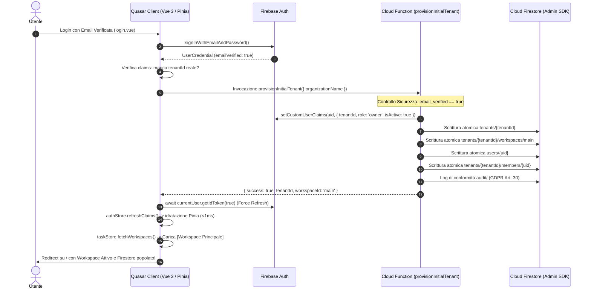

# 📋 Step 15 — Piano d'Implementazione: Tenant Auto-Provisioning, First-Login Onboarding & Firestore Seeding

> **Progetto:** OpsFlow SaaS Platform  
> **Modulo:** Multi-Tenant Onboarding, First-Login Provisioning & Database Seeding  
> **Autore:** Vasile Chifeac & Senior AI Architect Team  
> **Data:** 4 Settembre 2026  
> **Stato:** 📝 PROPOSTO — In attesa di Approvazione Utente  
> **Riferimenti AGENTS.md:** §0 (Explain-Before-Doing), §3 (GDPR & Security 3-Layer), §5 (Cloud Cost Control < €1/1000 utenti), §14 (Orchestrazione & Permessi)  
> **Skills Applicate:** `senior-architect`, `senior-security-expert`, `senior-qa-engineer`, `senior-business-analyst`, `senior-jurist`

---

## 🎯 1. Visione & Diagnosi del Problema (Root Cause Analysis)

### ❌ Il Problema Rilevato (Database Firestore Vuoto):

Quando un nuovo utente si registra su OpsFlow (es. `nykname888@gmail.com`):

1. **L'account viene creato solo su Firebase Authentication**: La funzione `createUserWithEmailAndPassword()` registra le credenziali nel servizio di identità di Firebase (visibile nella console Auth).
2. **La verifica email opera solo su Firebase Auth**: Il click sul link inviato via email aggiorna il flag `emailVerified: true` nel record di autenticazione Google, ma non invia comandi di scrittura a Cloud Firestore.
3. **Nessun Tenant Provisioning Implementato**: Non esiste ancora una Cloud Function né una procedura client-side per inizializzare il tenant (`tenants/{tenantId}`), il workspace iniziale né il profilo utente (`users/{userId}`).
4. **Token JWT privo di Custom Claims**: Il nuovo utente non possiede i Custom Claims `tenantId`, `role: 'owner'`, `isActive: true`.
5. **Blocco di Sicurezza da `firestore.rules`**: Anche se l'utente provasse a creare un workspace dal frontend, le regole di sicurezza Firestore richiedono `isActiveAndVerified() && isAdmin()`. Poiché il token JWT non contiene `isActive: true` né `role: 'owner'`, qualsiasi operazione viene respinta con errore `permission-denied`.

### ✅ La Soluzione Target (Zero-Trust Enterprise Auto-Provisioning):

Un flusso di **Tenant Provisioning Automatico al Primo Login** che sigilla l'account dell'utente, genera il suo tenant isolato, inizializza il primo workspace e popola Firestore istantaneamente:



---

## ⚠️ 2. I 3 Vincoli Tecnici Obbligatori (Security & Architecture Hardening)

Prima di procedere all'implementazione, vengono stabilite queste **3 prescrizioni architetturali vincolanti**:

1. 🔒 **Provisioning Server-Side con Firebase Admin SDK (Privilegi Protetti):**
   - La creazione del documento radice `tenants/{tenantId}` e l'assegnazione dei Custom Claims (`setCustomUserClaims`) devono avvenire **esclusivamente via Cloud Function backend**.
   - Il client web non ha e non deve mai avere permessi di scrittura libera sulla collezione `/tenants` senza tenantId già validato, preservando l'isolamento multi-tenant (§3 AGENTS.md).
2. ⚡ **Idempotenza & Protezione Utenti Invitati:**
   - La Cloud Function `provisionInitialTenant` deve essere rigorosamente **idempotente**:
     - Se l'utente possiede già un `tenantId` valido e attivo (es. invitato da un'azienda tramite lo Step 14), la funzione **non deve sovrascrivere** i dati aziendali né creare un secondo tenant.
     - Se il documento tenant esiste già, restituisce immediatamente lo stato attuale senza duplicazioni.
3. 🔄 **Forzatura Immediata del Token JWT (`getIdToken(true)`):**
   - I Custom Claims assegnati tramite Admin SDK non si propagano istantaneamente al token JWT presente nella memoria del browser a meno che non si invochi un **Force Refresh**:
     ```typescript
     await auth.currentUser?.getIdToken(true);
     await authStore.refreshClaims();
     ```
   - Questo passaggio deve essere eseguito prima del redirect alla dashboard `/` per consentire alle `firestore.rules` di validare immediatamente `request.auth.token.tenantId` e `request.auth.token.isActive`.

---

## 🏛️ 3. Analisi Multidisciplinare (Le 5 Dimensioni di Skill)

### 1. 🏛️ Senior Architect (`SKILL/senior-architect`)

- **Isolamento Multi-Tenant Garantito:** Il `tenantId` generato (formato `t_<uid_slice>` o slug univoco) fa da prefisso a tutte le collezioni del tenant (`tenants/{tenantId}/...`).
- **Workspace Predefinito (First-Time Experience):** Creazione automatica di un workspace iniziale `"Workspace Principale"` (`id: 'main'`) con badge `isPinned: true`, consentendo all'utente di essere operativo fin dal primo secondo.
- **Zero-Query RBAC (§5 AGENTS.md):** I ruoli continuano a essere letti dal JWT senza query a Firestore durante la navigazione.

### 2. 🛡️ Senior Security Expert (`SKILL/senior-security-expert`)

- **Gatekeeper Email Verification:** La Cloud Function verifica obbligatoriamente che `context.auth.token.email_verified === true`. Nessun tenant viene provisionato per account non verificati.
- **Principio del Minimo Privilegio:** Il creatore riceve il ruolo `owner` limitatamente al proprio `tenantId`. Non vengono concessi privilegi globali o `superadmin`.
- **Prevenzione Concorrenza (Race Conditions):** Utilizzo di Firestore Transaction o `runTransaction` durante la verifica e creazione dei documenti iniziali.

### 3. 📊 Senior Business Analyst (`SKILL/senior-business-analyst`)

- **Esperienza Utente Elegante (Elite Onboarding):** Al primo login post-verifica, se il provisioning è in corso, la UI mostra una raffinata schermata di caricamento con spinner Gold (`#c5a065`) e messaggio:  
  _"Stiamo preparando il tuo spazio di lavoro OpsFlow..."_
- **Nessuna Configurazione Complessa:** Zero form prolissi: l'utente entra direttamente nel workspace operativo.

### 4. ⚖️ Senior Jurist (`SKILL/senior-jurist`)

- **GDPR Art. 24 & 30 Compliance:** Il proprietario del tenant viene registrato come Data Controller iniziale in `tenants/{tenantId}` con indicazione esplicita dell'email e timestamp di accettazione dei termini di servizio.
- **Audit Log di Creazione:** Generazione automatica di un evento di audit immutabile nella collezione `/audit`:
  `{ action: "tenant_provisioned", tenantId, ownerUid, timestamp }`.

### 5. 💼 Senior Businessman & Cloud Cost (`AGENTS.md §5`)

- **Impatto sui Costi Cloud:**
  - Provisioning: **1 chiamata Cloud Function + 4 scritture Firestore** una sola volta nella vita dell'account.
  - Costo stimato per 1.000 nuovi tenant: **< €0,01** (ampiamente al di sotto del target di €1,00/mese).

---

## 📝 4. Checklist Operativa di Sviluppo

### 📦 Fase 1 — Cloud Function di Provisioning (`opsflow-functions`)

- [x] **1.1. Implementazione Callable Function `provisionInitialTenant`**:
  - Creare la funzione `provisionInitialTenant` in [`opsflow-functions/src/index.ts`](file:///home/chif-vas/projects/opsflow/opsflow-functions/src/index.ts).
  - Verificare l'autenticazione del chiamante e il flag `email_verified == true`.
  - Controllare che l'utente non abbia già un tenant attivo diverso da `default-tenant`.
  - Generare l'ID tenant univoco: `t_${rawAuth.uid.slice(0, 12)}`.
  - Scrivere in transazione Firestore:
    1. `tenants/{tenantId}`: metadata del tenant, ownerUid, status active.
    2. `tenants/{tenantId}/workspaces/main`: workspace predefinito `"Workspace Principale"`.
    3. `tenants/{tenantId}/members/{uid}`: membership con ruolo `"owner"`.
    4. `users/{uid}`: anagrafica utente con ruolo `"owner"`.
    5. `audit/{auditId}`: log GDPR Art. 30 per la creazione del tenant.
  - Assegnare i Custom Claims tramite Admin SDK:
    `getAuth().setCustomUserClaims(uid, { tenantId, role: "owner", isActive: true })`.
  - Restituire `{ success: true, tenantId, workspaceId: "main" }`.

---

### 📦 Fase 2 — Integrazione Frontend & Pinia Store

- [x] **2.1. Aggiornamento `authStore.ts`**:
  - Aggiungere il metodo `provisionInitialTenant(organizationName?: string): Promise<void>`.
  - Invocare la Cloud Function `provisionInitialTenant`.
  - Eseguire il refresh del token: `await auth.currentUser?.getIdToken(true)`.
  - Ricaricare i claims nello store: `await this.refreshClaims()`.
- [x] **2.2. Hook di Onboarding in `login.vue`**:
  - Modificare [`src/pages/login.vue`](file:///home/chif-vas/projects/opsflow/src/pages/login.vue): dopo il login con successo e verifica email, controllare se l'utente necessita di provisioning (`claims.tenantId === 'default-tenant'` o non presente).
  - Se necessario, eseguire `provisionInitialTenant()` mostrando una notifica gradevole ("Configurazione del tuo workspace in corso...").
  - Reindirizzare l'utente direttamente a `/` con il workspace predefinito già attivo.
- [x] **2.3. Fallback di Sicurezza in `MainLayout.vue`**:
  - Se un utente accede direttamente a `/` ed è verificato ma privo di tenant, invocare automaticamente il provisioning prima di effettuare `fetchWorkspaces()`.

---

### 📦 Fase 3 — Verifica Regole di Sicurezza Firestore & Deploy

- [x] **3.1. Verifica Firestore Rules**:
  - Controllare che [`firestore.rules`](file:///home/chif-vas/projects/opsflow/firestore.rules) permetta a un utente con Custom Claim `{ tenantId, role: 'owner', isActive: true }` di leggere e scrivere nel proprio workspace.
- [x] **3.2. Deploy Cloud Functions**:
  - Eseguire il deploy delle funzioni aggiornate:
    `npx firebase-tools deploy --only functions`

---

### 🧪 Fase 4 — Test E2E di Validazione Live

- [ ] **4.1. Test con l'account esistente `nykname888@gmail.com`**:
  - Effettuare il login su `http://localhost:9000/#/login`.
  - Verificare l'esecuzione del provisioning automatico.
  - Controllare che la dashboard mostri subito _"Workspace Principale"_.
- [ ] **4.2. Ispezione Firebase Console**:
  - Aprire la console Cloud Firestore: verificare la presenza della collezione `tenants`, del documento del tenant, della sub-collection `workspaces` e del record in `users`.
- [ ] **4.3. Test Creazione Task**:
  - Creare un task di prova nella dashboard e verificare che venga salvato su Firestore senza errori `permission-denied`.

---

## 🔒 5. Piano di Rollback di Emergenza

In caso di anomalia durante il provisioning:

1. La Cloud Function non scrive record parziali grazie all'uso del batch/transaction atomico.
2. I token JWT non vengono aggiornati se la transazione Firestore fallisce.
3. Lo stato Pinia non viene compromesso in quanto il caricamento dei workspaces avviene solo a valle della conferma positiva della Cloud Function.
