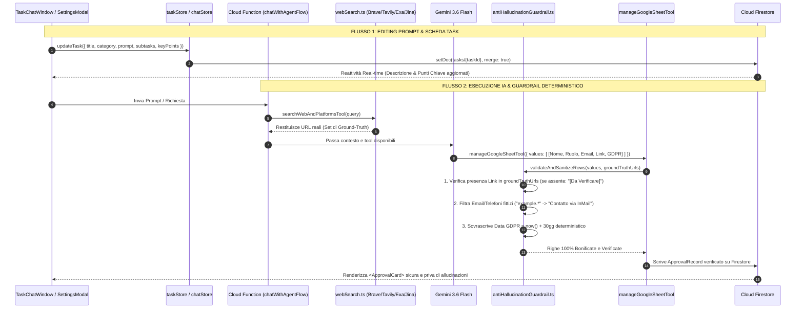

# 📋 STEP 21 — Task Live Editing (Prompt & Card) + Deterministic Backend Anti-Hallucination Guardrails

> **Status:** 🟢 APPROVATO AL 100% — In Fase di Esecuzione  
> **Autore:** Vasile Chifeac & AI Senior Architect, AI Engineer, Security Expert & Senior Jurist  
> **Data:** 2026-09-17  
> **Progetto:** OpsFlow SaaS (Quasar 2, Vue 3, Pinia, Firebase Cloud Functions Gen 2, Cloud Firestore, Genkit, Gemini 3.6 Flash)  
> **Riferimenti Normativi & Architetturali:** [AGENTS.md](file:///home/chif-vas/projects/opsflow/AGENTS.md) (§0, §1, §3, §4, §5, §6, §9, §10, §14), [SECURITY.md](file:///home/chif-vas/projects/opsflow/SECURITY.md), [SKILL/senior-architect](file:///home/chif-vas/projects/opsflow/SKILL/senior-architect/SKILL.md), [SKILL/senior-security-expert](file:///home/chif-vas/projects/opsflow/SKILL/senior-security-expert/SKILL.md), [SKILL/senior-jurist](file:///home/chif-vas/projects/opsflow/SKILL/senior-jurist/SKILL.md), [SKILL/ai-engineer](file:///home/chif-vas/projects/opsflow/SKILL/ai-engineer/SKILL.md), [SKILL/prompt-engineer](file:///home/chif-vas/projects/opsflow/SKILL/prompt-engineer/SKILL.md)

---

## 🎯 1. Visione del Sistema & Valutazione di Fattibilità

### 1.1 I Tre Problemi Operativi Riscontrati

1. **Inaccessibilità e Immutabilità del Prompt del Task Attivo (`TaskSettingsModal.vue`):**
   - Attualmente la modale delle Impostazioni Operative del Task (`TaskSettingsModal.vue`) gestisce unicamente i fogli Google collegati, la firma email e la sincronizzazione con il Master DB.
   - Il **Titolo del Task**, la **Categoria Operativa** e soprattutto il **Prompt / Obiettivo dell'Agente IA** sono stati inseriti all'atto della creazione iniziale ("New Operational Task for AI") e non possono più essere visualizzati né modificati per il task attivo.
   - L'operatore necessita di poter aprire le impostazioni del task in corso (es. _"Docente Oracle/RAC Milano | Workspace: NobleProg"_) e ritoccare il prompt o il titolo senza perdere il contesto operativo del task né dover ricreare un task da zero.

2. **Cruscotto Laterale Statico in Sola Lettura (`TaskChatWindow.vue`):**
   - Nel pannello laterale destro della chat, le sezioni **"Descrizione Task"**, **"Sotto-Task Operative (4/4)"** e **"Punti Chiave del Task"** sono elementi statici generati all'inizio da AgentePlanner.
   - Se l'operatore nota un refuso, deve aggiornare una scadenza, eliminare una sotto-task o aggiungere un nuovo punto chiave a mano, non ha a disposizione un pulsante "Modifica" dedicato.

3. **Vulnerabilità all'Allucinazione Generativa nei Dati Tabellari (`manageGoogleSheetTool`):**
   - I System Prompt mitigano l'allucinazione, ma i modelli linguistici (Gemini 3.6 Flash) rimangono probabilistici. Se un profilo web pubblico non espone un'email o un link specifico, l'LLM rischia di inventare:
     - URL LinkedIn inesistenti o 404 (es. dedotti e interpolati dal nome).
     - Email fittizie su domini sintetici (es. `d.benvenuti@example-consulting.it`).
     - Numeri telefonici inventati o sequenziali (`+39 340 1234567`).
     - Date di conformità GDPR arbitrarie o retrograde (es. date del 2024).
   - Attualmente il tool `manageGoogleSheetTool` riceve la matrice `values: string[][]` dall'LLM e la memorizza in Firestore in `ApprovalCard.vue` **senza alcun middleware di convalida deterministica a livello di codice**.
   - Inoltre, in caso di token Google OAuth scaduto (`invalid_grant`), la Cloud Function `resolveApproval` restituisce un generico **HTTP 500** mascherando l'errore ed impedendo alla UI di proporre la riconnessione in 1 click.

### 1.2 Verdetto di Fattibilità: 🟢 FATTIBILE AL 100%

- **Zero Costi Cloud Aggiuntivi (§5):** Il guardrail antiallucinazione è un middleware puro in Node.js (filtri regex, confronto su Set in memoria, calcolo temporale deterministico). Non effettua chiamate LLM supplementari né query a pagamento su Firestore.
- **Full-Stack Alignment (§0):** Le modifiche al prompt e alla scheda del task aggiornano in tempo reale sia Firestore (`tasks/{taskId}`) sia lo store locale Pinia (`useTaskStore`), con riflesso immediato a schermo.
- **GDPR Art. 14 e Art. 32 Compliance (§3):** La data di notifica informativa (+30 giorni) viene calcolata deterministicamente dal timestamp di sistema, eliminando le allucinazioni temporali.

---

## 🧠 2. Analisi Multi-Ruolo & Peer Review (5 Livelli di Revisione §9)

### 🏗️ 2.1 Senior Architect Review (opsflow-senior-architect)

- **Separazione delle Responsabilità (Separation of Concerns):**
  - La logica di filtraggio e validazione deve risiedere in un modulo isolato: `opsflow-functions/src/tools/antiHallucinationGuardrail.ts`.
  - `manageGoogleSheetTool` delega la bonifica a questo modulo prima di invocare Firestore.
- **Data Flow del Prompt Editing:**
  - `TaskSettingsModal.vue` si arricchisce di un tab principale _"1. Obiettivo & Prompt IA"_ (portando a 4 i tab totali: _Prompt_, _Fogli_, _Email_, _Master DB_).
  - Il salvataggio aggiorna `task.title`, `task.category`, `task.prompt` (o `task.description`) tramite `taskStore.updateTask(workspaceId, taskId, payload)`.

### 💼 2.2 Senior Business Analyst & ROI (opsflow-senior-business-analyst)

- **Zero Falso Lavoro:** Evitare che l'operatore chiami numeri inesistenti o invii email a indirizzi inventati genera un ROI immediato in termini di ore/uomo risparmiate.
- **Flessibilità Operativa:** La possibilità di correggere direttamente la descrizione e i punti chiave permette di adattare il task in tempo reale alle indicazioni del cliente finale (es. _"cambiato il target da Milano a Bologna"_).

### 🛡️ 2.3 Senior Security Expert & Hacker (opsflow-senior-security-expert)

- **Ground-Truth Matching contro Phishing & Spoofing:** Nessun link esterno può essere inserito nel foglio di lavoro se non appartiene all'insieme dei risultati effettivamente restituiti dai motori certificati (`Brave`, `Tavily`, `Exa`, `Jina`).
- **Resilienza OAuth in `resolveApproval`:** Intercettare esplicitamente l'errore `invalid_grant` ("Token has been expired or revoked") e restituire uno status HTTP **401** pulito con `{ error: "oauth_error", code: "TOKEN_EXPIRED" }`, consentendo al frontend di mostrare la richiesta di riconnessione immediata senza fallimenti opachi.

### ⚖️ 2.4 Senior Jurist & Privacy (opsflow-senior-jurist)

- **GDPR Art. 14 (Informativa entro 30 giorni):** L'art. 14 comma 3 lett. a impone l'informativa all'interessato entro un termine ragionevole, e al più tardi entro un mese dalla raccolta. Forzare deterministicamente `Data_Corrente + 30 giorni` a livello di backend assicura che il registro di audit sia sempre giuridicamente inattaccabile.
- **Principio di Esattezza (GDPR Art. 5, par. 1, lett. d):** I dati personali devono essere esatti e aggiornati. Il blocco preventivo dei recapiti sintetici evita l'archiviazione di PII inesatte o fraudolente nel DB aziendale.

### 🤖 2.5 Prompt & AI Engineer (opsflow-prompt-engineer & ai-engineer)

- **Collaborazione Codice + Prompt:** I prompt DO/DON'T restano la prima linea di difesa, mentre il middleware deterministico TypeScript costituisce la barriera invalicabile.
- **Riconoscimento Sfumature di Contatto:** Se un profilo pubblico non espone un'email, il sistema non blocca la riga ma popola la colonna contatto con la stringa standard: `"Contatto via InMail / Profilo Pubblico"`.

---

## 🗺️ 3. Diagramma di Flusso Tecnico



---

## 📋 4. Matrice Operativa delle Fasi di Implementazione (Checklist)

### 📌 FASE 1: Live Editing Prompt, Titolo e Categoria in `TaskSettingsModal.vue`

- [ ] **1.1** In [src/components/TaskSettingsModal.vue](file:///home/chif-vas/projects/opsflow/src/components/TaskSettingsModal.vue), aggiungere il tab prioritario `prompt` (_"1. Obiettivo & Prompt IA"_), riordinando gli altri tab (`prompt`, `sheet`, `email`, `sync`).
- [ ] **1.2** Legare in modo bidirezionale i campi del task corrente:
  - `editTitle = ref(props.task.title)`
  - `editCategory = ref(props.task.category || 'general')`
  - `editPrompt = ref(props.task.description || '')`
- [ ] **1.3** Sincronizzare i campi al variare della prop `task` (`watch(() => props.task, ...)`).
- [ ] **1.4** Nel metodo `handleSave`, aggiornare il documento del task in Firestore tramite `taskStore.updateTask(props.workspace.id, props.task.id, { title, category, description })`.
- [ ] **1.5** Aggiungere un pulsante opzionale _"Rigenera Sotto-Task con AgentePlanner"_ che, se cliccato dall'utente, invoca la logica di pianificazione automatica per aggiornare le sotto-task operative in base al nuovo prompt.
- [ ] **1.6** Mostrare notifica Quasar di conferma salvataggio e aggiornare reattivamente il titolo nell'header della modale e della chat.

---

### 📌 FASE 2: Editing Diretto Scheda Task nel Pannello Destro di `TaskChatWindow.vue`

- [ ] **2.1** Nel pannello laterale destro di [src/components/TaskChatWindow.vue](file:///home/chif-vas/projects/opsflow/src/components/TaskChatWindow.vue):
  - Inserire un pulsante icona `edit` ("Modifica Scheda") nell'header della sezione **📌 Descrizione Task**.
  - Inserire un pulsante icona `edit` accanto al contatore delle **🔀 Sotto-Task Operative**.
  - Inserire un pulsante icona `edit` nella sezione **💡 Punti Chiave del Task**.
- [ ] **2.2** Creare una modalità di editing elegante (o un dialog compatto `TaskDetailsEditModal.vue`):
  - Modifica testo libero della Descrizione.
  - Aggiunta, cancellazione e rinomina delle Sotto-Task operative individuali.
  - Modifica o riordino dei Punti Chiave.
- [ ] **2.3** Integrare il salvataggio immediato in Firestore e nello store Pinia con feedback visivo.

---

### 📌 FASE 3: Modulo Guardrail Antiallucinazione in `opsflow-functions`

- [ ] **3.1** Creare il file `opsflow-functions/src/tools/antiHallucinationGuardrail.ts` con JSDoc standard e marcatori di chiusura (§4 AGENTS.md).
- [ ] **3.2** Definire la struttura dati `SanitizationResult`:
  ```typescript
  export interface SanitizationResult {
    sanitizedValues: string[][];
    correctionsCount: number;
    flags: {
      unverifiedUrlsRemoved: number;
      syntheticEmailsBlocked: number;
      gdprDatesNormalized: number;
    };
  }
  ```
- [ ] **3.3** Implementare il controllo **Ground-Truth Matching per gli URL** con **Normalizzazione Rigorosa**:
  - Funzione `normalizeUrl(url: string): string`: rimozione di parametri query/tracciamento (`?utm_source=...`, `?ref=...`), strip del trailing slash finale, conversione dominio in minuscolo e neutralizzazione protocollo (`http` vs `https`).
  - Il confronto tra l'URL proposto dall'LLM e i risultati di ricerca deve avvenire esclusivamente tra stringhe normalizzate per evitare di scartare profili reali a causa di redirect o parametri analitici.
  - Se un URL LinkedIn/Malt/GitHub non appartiene alla whitelist dei risultati reali, sostituire o annotare la cella con `[Profilo non certificato dai motori]`.
- [ ] **3.4** Implementare il filtro **Anti-Dati Sintetici (Email & Telefoni)**:
  - Regex per domini fittizi: `/@(example\.|test\.|example-consulting\.|company\.|fake\.)/i`.
  - Regex per telefoni sequenziali/dummy: `/^(\+?[0-9\s-]{4,})?$/` verificando assenza di sequenze ripetitive come `1234567` o `0000000`.
  - Sostituzione sicura della cella contatto: `"Contatto via InMail / Profilo Pubblico"` se non derivante da estrazione certa da sito aziendale.
- [ ] **3.5** Implementare il calcolo **Deterministico GDPR Art. 14 (+30 giorni)**:
  - Riconoscere la colonna contenente date o riferimenti GDPR.
  - Sovrascrivere deterministicamente il valore calcolando `new Date(Date.now() + 30 * 24 * 60 * 60 * 1000).toLocaleDateString('it-IT')` (eliminando date arbitrarie o storiche tipo 2024).

---

### 📌 FASE 4: Integrazione Guardrail in `googleWorkspace.ts`, `chatFlow.ts` e `ApprovalCard.vue`

- [ ] **4.1** In `opsflow-functions/src/tools/googleWorkspace.ts`, aggiornare il tool `manageGoogleSheetTool`:
  - Passare le righe grezze al middleware `validateAndSanitizeRows()`.
  - Utilizzare le righe bonificate sia per `previewRows` sia per `rowsJson` nel record `approvalRecord`.
- [ ] **4.2** In `opsflow-functions/src/ai/chatFlow.ts`, implementare il **Buffer Multi-Query nel Contesto di Turno**:
  - Quando l'Agente esegue 2 o più ricerche progressive nello stesso turno operativo, il Set `groundTruthUrls` accumula e aggrega tutti i link estratti da tutte le chiamate di ricerca eseguite in quel turno (evitando di sovrascrivere o perdere i risultati della prima ricerca).
- [ ] **4.3** Aggiungere un messaggio di riepilogo nella chat o nella card di approvazione se sono state applicate correzioni di sicurezza (es. _"OpsFlow Guardrail: 2 email fittizie convertite in contatto InMail, data GDPR forzata a +30gg"_).
- [ ] **4.4** In [src/components/ApprovalCard.vue](file:///home/chif-vas/projects/opsflow/src/components/ApprovalCard.vue), aggiungere il **Badge di Certificazione Visuale**:
  - Mostrare un chip/badge verde discreto (es. `🛡️ Link Verificato`) accanto all'URL del candidato nella card di approvazione per dare visibilità immediata all'operatore che il profilo è passato attraverso il filtro di conformità backend.

---

### 📌 FASE 5: Risoluzione Errore 500 su OAuth Token Expired (`resolveApproval`)

- [ ] **5.1** In `opsflow-functions/src/index.ts` all'interno della Cloud Function `resolveApproval`:
  - Nel blocco `catch (err)`, intercettare sia `err instanceof OAuthVaultError` sia gli errori lanciati da `googleapis` / `gaxios` con `err.response?.data?.error === "invalid_grant"` o messaggio `"Token has been expired or revoked"`.
  - Restituire codice HTTP **401** con payload:
    ```json
    {
      "error": "oauth_error",
      "code": "TOKEN_EXPIRED",
      "message": "Il token di autorizzazione Google è scaduto o è stato revocato. Riconnetti l'account."
    }
    ```
- [ ] **5.2** In [src/components/TaskChatWindow.vue](file:///home/chif-vas/projects/opsflow/src/components/TaskChatWindow.vue#L1248-L1258):
  - Intercettare il codice HTTP 401 e la presenza di `result?.error === "oauth_error"`.
  - Invocare `chatStore.setSessionOAuthError(taskId, result)` per far comparire il banner interattivo _"Riconnetti Account Google"_ anziché una notifica di errore generico 500.

---

### 📌 FASE 6: Collaudo, Typecheck & Verifica (§7 Pre-Commit Checklist)

- [ ] **6.1** Esecuzione `yarn --ignore-engines typecheck` su Frontend con zero errori.
- [ ] **6.2** Esecuzione `yarn --ignore-engines lint:check` su Frontend con zero warning e zero errori su tutti i file.
- [ ] **6.3** Compilazione TypeScript di `opsflow-functions` (`npm run build` in `opsflow-functions/`) con zero errori.
- [ ] **6.4** Test manuale del flusso:
  1. Apertura "Impostazioni Operative Task" $\rightarrow$ modifica Titolo e Prompt $\rightarrow$ verifica aggiornamento istantaneo su Firestore.
  2. Modifica diretta della Descrizione dal pannello destro $\rightarrow$ verifica salvataggio.
  3. Simulazione approvazione con token scaduto $\rightarrow$ verifica comparsa banner 401 di riconnessione.
  4. Generazione tabella da parte dell'Agente $\rightarrow$ verifica applicazione guardrail antiallucinazione (link verificati, contatti protetti e data GDPR deterministica).
- [ ] **6.5** Aggiornamento documentazione nel walkthrough e nel diagramma di flusso.

---

## 🛡️ 5. Considerazioni di Sicurezza & Conformità GDPR

1. **Minimizzazione dei Dati (GDPR Art. 5):** Nessun recapito inventato o errato finisce nel database o nel foglio aziendale.
2. **Registro dei Trattamenti (GDPR Art. 30):** Le correzioni operate dal guardrail vengono tracciate nei log applicativi protetti (senza PII in chiaro).
3. **Integrità e Riservatezza (GDPR Art. 32):** Il token OAuth viene gestito nel Vault cifrato (AES-256-GCM); l'errore di token revocato viene gestito in modo sicuro senza propagare stack trace di backend all'utente finale.
