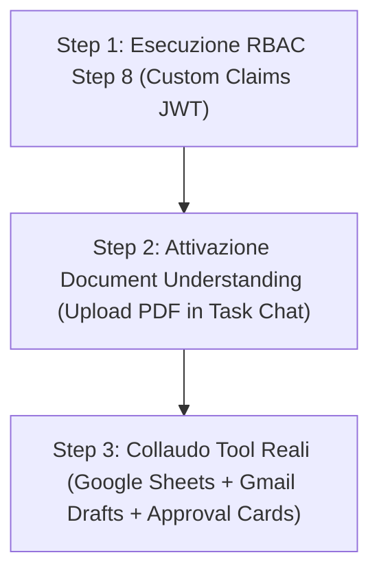

# 📋 Step 9 — Piano Strategico ed Operativo d'Integrazione (Scopi Operativi OpsFlow)

> **Progetto:** OpsFlow SaaS Platform  
> **Autore:** Vasile Chifeac & AI Pair Architect  
> **Data:** 16 Agosto 2026  
> **Stato:** Completed / Implementato  
> **Riferimenti AGENTS.md:** §0 (Explain-Before-Doing), §3 (GDPR & Security 3 Layer), §5 (Cloud Cost Optimization), §14 (Agent Architecture & Genkit)

---

## 🧠 1. Analisi Strategica: Cosa Conviene, Cosa NO e Come Procedere

L'obiettivo di **OpsFlow** è fornire un hub di **Operational Intelligence & Time Management** ad altissimo valore pratico per professionisti ed aziende (es. VersiliaCare, CarFlow, ProfessioneSiCura), mantenendo i costi totali del cloud inferiori a **€ 1.00 - 2.00/mese** per 1000 utenti ed azzerando la manutenzione complessa.

---

## 🟢 2. Funzionalità che Conviene Integrare (Alta Priorità / ROI Massimo)

### A. RBAC Step 8 (Custom Claims JWT — Zero Query Firestore)

- **Perché conviene:** È il marchio di fabbrica architetturale di OpsFlow. Salva i ruoli (`superadmin`, `admin`, `user`) ed il `tenantId` direttamente nel token JWT di Firebase Auth.
- **Valore operativo:** Protegge la UI e le Firestore Rules in tempo reale, azzera le letture al database per l'autorizzazione (**-99,98% costi DB**) e gestisce i collaboratori/consulenti esterni su specifici workspace.

### B. Document Understanding (Upload PDF & Documenti — Multimodalità Nativa Gemini)

- **Perché conviene:** Gemini 3.5/3.7 Flash supporta la lettura ed il ragionamento nativo su file PDF e documenti fino a **1.000 pagine**.
- **Valore operativo:** Permette di trascinare un PDF (contratto, fattura, referto clinico/normativo, capitolato) direttamente nella Task Chat e chiedere all'Agente AI: _"Estrai i punti chiave, verifica le scadenze e compila la tabella delle spese"_. Zero costi di OCR esterni.

### C. Multi-Model Tiering (Gemini 3.5 Flash-Lite + Gemini 3.5/3.7 Flash)

- **Perché conviene:** Utilizza modelli ultra-economici a bassissima latenza (`gemini-3.5-flash-lite`) per la scomposizione delle sotto-task (`AgentePlanner`) ed i micro-task, riservando i modelli più potenti (`gemini-3.7-flash`) alla stesura finale di report complessi.
- **Valore operativo:** Mantiene i costi di calcolo LLM sotto **€ 1,50/mese** garantendo al contempo velocità e qualità.

### D. Human-in-the-Loop con `<ApprovalCard.vue>`

- **Perché conviene:** L'IA non esegue mai scritture o invii esterni in autonomia. Visualizza un'anteprima chiara (_diff_ del foglio o bozza email) con i pulsanti `[✅ Approva ed Esegui]` e `[❌ Rifiuta]`.
- **Valore operativo:** Garantisce sicurezza totale ed azzera i rischi di invio mail errate o sovrascrittura di fogli di calcolo.

### E. Dettatura Vocale Nativa (Web Speech API Browser)

- **Perché conviene:** Sfrutta le API vocali integrate gratuitamente in tutti i browser (Chrome, Safari, Edge) per la sintesi vocale e la dettatura di note/task.
- **Valore operativo:** **€ 0,00 di costi Cloud**, funziona a latenza zero e senza consumare banda o token API.

---

## 🔴 3. Tecnologie da NON Integrare (Trappole di Tempo e Costi Inutili)

- ❌ **Live Voice API di Google (WebSockets Real-time Cloud):** Genera costi elevati al secondo per connessioni aperte continue. _Soluzione:_ Si usano le Web Speech API native del browser (€ 0,00).
- ❌ **Generazione Immagini Nativa (Nano Banana / Imagen):** OpsFlow è un hub di dati e produttività operativa, non un editor grafico. _Soluzione:_ Utilizzare tool esterni una tantum.
- ❌ **Riscrivere il Backend per "Interactions API":** Il backend attuale basato su Genkit 1.39 + Cloud Functions Gen 2 è solido, tipizzato e performante. _Soluzione:_ Attendere l'aggiornamento nativo dell'SDK Genkit.
- ❌ **Generazione Video (Veo) / Robotics:** Totalmente fuori perimetro rispetto agli obiettivi di time management aziendale.

---

## 📊 Tabella di Confronto & Scelte Finali

| Feature / Tecnologia                   |      Conviene?       | Perché / Come Implementarla                              |     Impatto Costi     |
| :------------------------------------- | :------------------: | :------------------------------------------------------- | :-------------------: |
| **RBAC Step 8 (Custom Claims)**        |   **SÌ (Subito)**    | Token JWT con `role` e `tenantId` per zero query DB.     |      **€ 0,00**       |
| **Document Understanding (PDF)**       |   **SÌ (Subito)**    | Caricamento file multimodale nativo in Task Chat.        |   Incluso nel Tier    |
| **Model Tiering (Flash-Lite / Flash)** |   **SÌ (Subito)**    | Routing automatico dei sotto-agenti in base al task.     |  **< € 1,50 / mese**  |
| **Jina AI Reader (`r.jina.ai`)**       | **SÌ (Già Attivo)**  | Web scraping B2B e sintesi Markdown pulita.              | **€ 0,00 (Gratuito)** |
| **Web Speech API (Voce Nativa)**       | **SÌ (Client-Side)** | Dettatura vocale nativa da browser senza API cloud.      |  **€ 0,00 (Nativo)**  |
| **Live Voice API (Cloud WebSocket)**   |        **NO**        | Costi al secondo non giustificati; usare Web Speech API. |   Evita costi alti    |
| **Image Generation (Nano Banana)**     |        **NO**        | Fuori scopo per un tool di produttività e dati.          | Evita costi/lentezza  |
| **Interactions API Migration**         |  **NO (Rimandare)**  | Attendere l'aggiornamento ufficiale dell'SDK Genkit.     | Evita debito tecnico  |

---

## 🛠️ 4. Piano Esecutivo in 3 Step (Roadmap di Sviluppo)

### 📌 Step 1: Esecuzione RBAC & Ruoli JWT (Ref. `step8_rbac_roles_implementation_plan.md`)

- [x] Protezione ruoli SuperAdmin (tenant management), Admin (workspace manager) e User (collaboratore).
- [x] Impostazione Custom Claims via Cloud Function `setUserRole`.
- [x] Filtraggio dinamico UI e Firestore Security Rules senza query al DB.

### 📌 Step 2: Attivazione Document Understanding (Upload PDF & File in Task Chat)

- [x] Aggiunta del pulsante di upload file/PDF nella modale `TaskChatWindow.vue`.
- [x] Invio del buffer base64 o riferimento Storage al backend Genkit Gemini Multimodal.
- [x] Estrazione automatica di tabelle, dati chiave e sintesi del documento.

### 📌 Step 3: Collaudo Tool Reali & Human-in-the-Loop (`<ApprovalCard.vue>`)

- [x] Test end-to-end del flusso: Ricerca Web → Sintesi Lead → Generazione Bozza Gmail / Tabella Google Sheets.
- [x] Verifica della card di approvazione visiva prima di ogni azione di scrittura finale.
- [x] Audit finale di sicurezza GDPR e validazione costi.

---

## 💡 Verdetto Finale

Il piano **Step 8 (RBAC Ruoli JWT)** e l'integrazione di **Document Understanding (PDF)** rappresentano la combinazione perfetta per rendere **OpsFlow** una piattaforma SaaS solida, ultra-sicura, economica e multi-settoriale.
