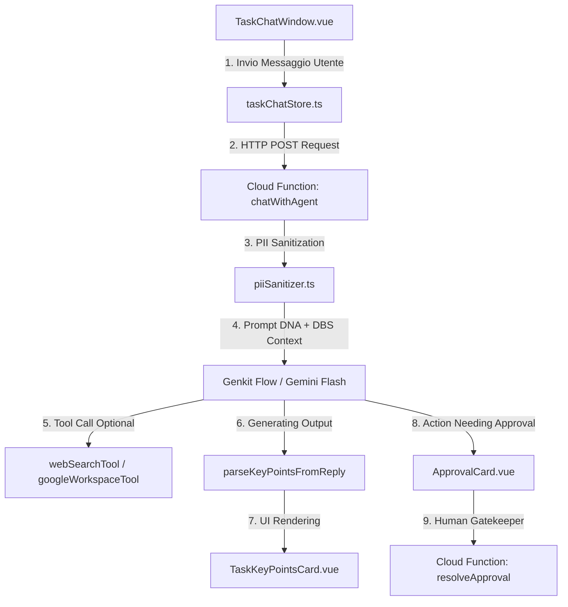
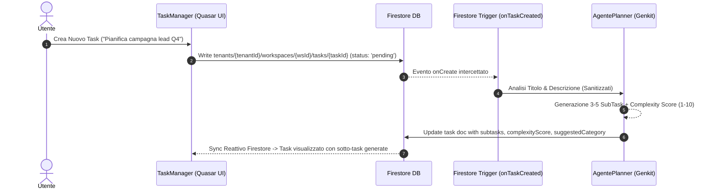
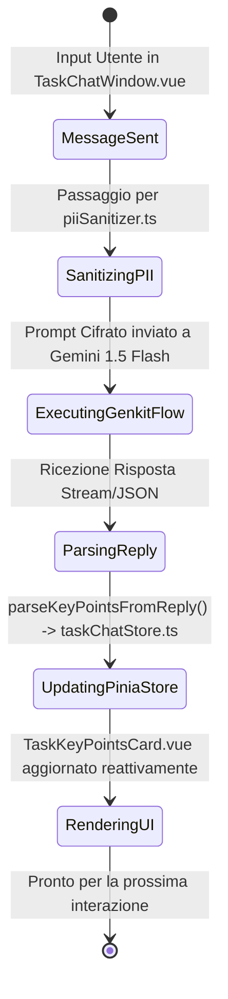
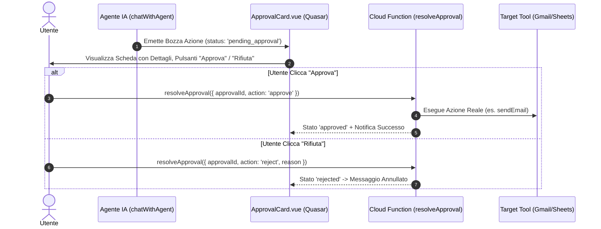

# 🏛️ OpsFlow — Architectural Flow 03: Task Execution, Working Memory & Human-in-the-Loop UI

> **Componente:** Task Management, Interactive Agent Chat Window, Working Memory & Execution Gateways  
> **Tecnologie:** Quasar 2 (`TaskChatWindow.vue`, `TaskKeyPointsCard.vue`, `ApprovalCard.vue`), Pinia (`taskChatStore.ts`), Genkit  
> **Standard:** Direttiva Fondamentale Full-Stack Alignment, Dynamic Working Memory, Human-in-the-Loop (§0, §14 AGENTS.md)  
> **Stato Documento:** Definitivo — Principal Architecture Approved

---

## 📌 1. Panoramica del Flusso Operativo Task

Il ciclo di vita di un Task in OpsFlow collega l'interfaccia utente Quasar con la pipeline agentica Genkit/Gemini. Ogni task risiede in `tenants/{tenantId}/workspaces/{wsId}/tasks/{taskId}` e combina la **Memoria di Lavoro Dinamica** (Sliding Window + Rolling Summary) con schede UI dedicate per l'approvazione ed il controllo dell'utente.



---

## 📋 2. Creazione Task & Trigger Agente Automatica

### Sequence Diagram: Task Creation & AgentePlanner Decomposition



---

## 💬 3. Ciclo Conversazionale, Memoria di Lavoro & Scheda Punti Chiave

### Il Modello di Memoria Conversazionale a 3 Livelli

Per garantire la massima reattività e costi inferiori a **€1.00/mese per 1.000 utenti** (§5 AGENTS.md), la conversazione si struttura su 3 livelli:

1. **Sliding Window:** Invio al LLM degli ultimi 5 messaggi della conversazione per mantenere il contesto immediato.
2. **Rolling Summary (Punti Chiave):** Sintesi automatica estratta dai messaggi dell'Agente via Regex parser `parseKeyPointsFromReply()`.
3. **UI Reattiva Isolata:** La scheda `TaskKeyPointsCard.vue` visualizza in tempo reale le informazioni strutturate (Lead, Requisiti, Azioni, Warning, GDPR) senza esporre JSON grezzo all'utente.



### Struttura Dati Punti Chiave (`TaskKeyPointsCard.vue`)

```typescript
export type KeyPointCategory = "leads" | "requirements" | "actions" | "warnings" | "gdpr";

export interface TaskKeyPoint {
  id: string;
  category: KeyPointCategory;
  text: string;
  timestamp: string;
}
```

---

## 🛡️ 4. Human-in-the-Loop & Execution Gate (`ApprovalCard.vue`)

### Direttiva Fondamentale (§0 AGENTS.md)

Nessuna azione di backend ad alto impatto (invio email Gmail, scrittura fogli Google Sheets, modifiche permanenti DB) viene eseguita dall'Agente in modo autonomo. L'Agente produce una **Bozza di Approvazione (Pending Approval Card)**.



---

## 📊 5. Matrice di Stato dei Task

| Stato Task          | Trigger UI                      | Azione Backend / Agente                              | Visibilità Utente                    |
| :------------------ | :------------------------------ | :--------------------------------------------------- | :----------------------------------- |
| `pending`           | Creazione Task                  | Cloud Function `onTaskCreated` genera sotto-task     | Scheda Task neutra con badge grigio  |
| `in_progress`       | Invio Primo Messaggio Chat      | `chatWithAgent` esegue prompt e tool chaining        | Badges reattivi + Rolling Key Points |
| `approval_required` | Agente emette proposta azione   | Generazione record in `tenants/{tenantId}/approvals` | `ApprovalCard.vue` in primo piano    |
| `completed`         | Chiusura Manuale / Ispezione OK | `onTaskUpdated` aziona `AgenteArchivista` per RAG KB | Badge verde + Storico note bloccato  |
